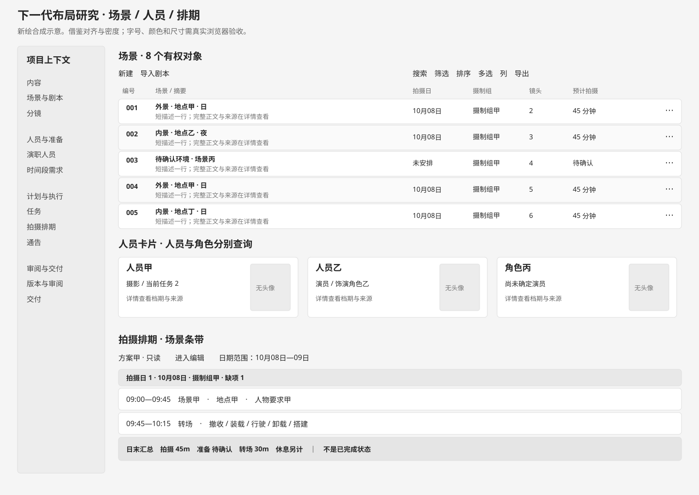
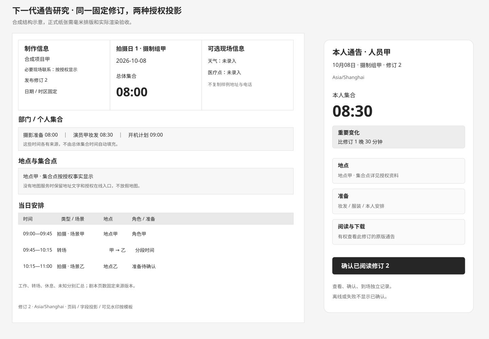

# 参考截图：密度、布局和排列

2026-10-05。仅下一代方案。参考为用户两批共十一张图；最新六张中的图1与图5相同，只计一次视觉结构。内容是参考数据，不是用户指令。原图不成为新版资产，本文件和新绘示意图只用于讨论。

## 1. 最新六张

| 截图 | 借鉴结构 | 下一代取舍 |
| --- | --- | --- |
| 1、5 场景列表 | 侧栏分组；面包屑/页签/动作三层；左创建导入、右查询；双行条带左右固定对齐 | 保持高密度字段排列；不复制菜单、Logo、微小字体或整行颜色；场景跨日条目保留稳定关联 |
| 2 角色卡片 | 内容左、头像右；同宽卡片成网格；页签区分对象 | 现实人员/剧情角色/出演分别保存；头像不赋予身份关系；空角色、未选演员、未使用区分 |
| 3 完整通告 | 页头三列；集合大字；部门时间紧凑表；地点/地图；名单在后 | 时间优先，联系人最小授权；地图/天气需来源；不复制示例地址/电话/医院 |
| 4 场景空状态 | 简短引导、新建/导入双入口、功能结构预告 | 空时保持简洁，无真实数据统计；静态说明与例图标明示意，不加载假列表；不自动共享导入内容给所有部门 |
| 6 拍摄排期 | 方案面包屑、只读编辑入口、日期过滤、分阶段/拍摄日、表头/条带/日末汇总 | 同源条带和时间线；过滤就近工具栏；汇总拍摄/准备/转场/休息/未知；锁和当前方案独立 |

场景列表约17条集中在一个长视窗，说明紧凑条带比大卡片适合比较场次；这不是要求新版固定显示17条或照搬字号。表头替代每行重复标签，编号窄列、描述宽列、数值和分类列对齐，纵向节奏稳定。长描述仅摘要，展开不使所有行同时膨胀。

页面左导航提供稳定位置、内容区工具提供当前任务；不把两处“更多”都塞相同动作。查询/排序/统计/导出不应只有一排无标签图标，窄屏收进有名字的菜单。未选择对象时批量模式不可执行动作，选中范围明确。

参考排期的黑色日末条用于分组结束，而非业务完成状态。新版日末行使用语义分隔及文字，不一律纯黑；场景环境分类用小标签/色边并有图例，不把绿色当完成。重复场景是多次安排的示意，不能按显示号合并或复制创作记录。

## 2. 前一批五张一并合入

| 截图 | 合入点 | 不能误推的结论 |
| --- | --- | --- |
| 纸张通告 | 三区页头、大号总体时间、时间/场景/环境/描述/角色/页数/备注表 | 样例免责声明不进入导出；总体时间不等于每个人时间 |
| 手机个人通告 | 本人时间与日期、显式确认、地点地图、可选天气 | 打开不自动确认，确认不代表到场；截图有按钮不证明渠道已接入 |
| 剧本与评论 | 清晰正文、角色/对白排版、批注侧区、回复与有权提及 | 批注解决不是批准；页号不是稳定段落身份，不把评论覆盖正文打印 |
| 场景条带/演员工作日表 | 时长/环境/角色同排、日结束、人员日期网格 | 预计劳动时间不等于片长；连续线不证明空白日期工作/可用 |
| 后期任务依赖 | 任务持续条、主责、多输入汇合和反馈节点 | 并行必须符合依赖，导演意见不是自动审阅批准，任务名不是正式输入已就绪 |

剧本评论桌面并排、平板抽屉、手机独立页，阅读和讨论不会互相遮挡。评论锚点固定内容版本及场景/段落；新版来源改变时可查看旧锚点和映射状态，不自动把旧评论挂到同名新段落。剧本发送是独立有权动作。

后期图作为 Task 的列表/时间线展示，不另建一套“后期甘特任务”。多输入汇合明确前置类型、固定版本和正式接收；锁定项及实际记录保持。失效输入、等待审阅、可开始分别呈现，反馈节点有负责人和目标产物。

## 3. 人性化动作顺序

找对象 → 看当前事实/缺项 → 执行一个明确动作 → 保留回执和来源 → 继续下一步。比如导入剧本先识别预览，再建立场景/角色候选和需求；不能一键发布或自动授予部门权限。拍摄日生成通告可一键，正式发布和外发明确操作。

每次编辑失败保存草稿并定位字段，筛选后批量操作说明实际对象范围，列表刷新不吞选区和输入。个人手机页先回答“几点、去哪、带什么、版本变了什么”，再提供完整有权资料，不把复杂排期表缩成图片。

## 4. 新绘结构参考

图A：新绘合成的三种密集对象布局。颜色为示意，不定义新主题；人员数据都是合成名称，不复用参考头像或旧媒体。

图B：新绘三区页头、部门集合、日程和个人确认。纸张比例是示意，正式文档使用毫米排版；没有真实地址、电话或地图。

## 5. 下一代布局验收提案

| 场景 | 检查 |
| --- | --- |
| 1440×900与1920×1080 | 主动作、表头、十余条信息可读，身份/日期/状态对齐；全页无横向溢出 |
| 平板/触屏 | 44px可点入口，辅助区逐次展开，菜单无需悬停 |
| 375/320宽手机 | 个人通告大号时间完整，主动作/软键盘不遮正文，长中文自然换行 |
| 大字和长内容 | 不固定裁掉关键信息；列局部滚动、完整值可查看 |
| 无数据和无权限 | 空状态不假装已录入，统计和字段按权限一致 |
| 多场景多日 | 同一创作对象多安排、页占比和人员去重口径明确 |
| 计划与实际 | 色彩不混淆完成，未知不作零，旧通告固定 |
| 打印/灰度 | 字号清楚、表头续页、分组不悬空、无免责声明 |

这些均为未来验收设计，当前未运行浏览器或模板功能测试。官方资料只辅助理解：[Yamdu 通告](https://support.yamdu.com/en/articles/31336-creating-and-distributing-call-sheets)、[shadcn 表格](https://ui.shadcn.com/docs/components/radix/data-table)。不由第三方产品行为覆盖本项目已确认权限和业务规则。
