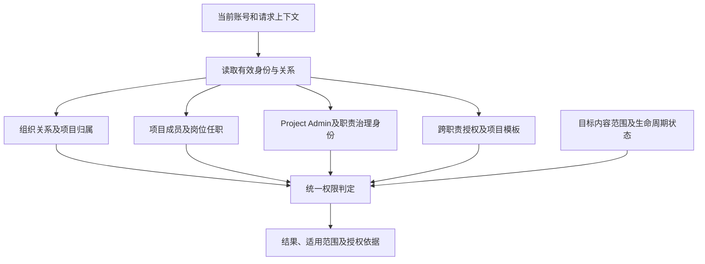

# FRAMEFORGE 权限架构设计

版本：1.1  
初始日期：2026-10-05  
本次修订：2026-10-06（Asia/Shanghai）  
状态：按用户最新要求，先设计权限架构，暂不编排具体功能点权限。已确认原则、架构设计和待确认边界分别记录；尚未实施。

文件路径继续使用 `next-generation/requirements/PERMISSION_ROLE_MODULE_MATRIX_2026-10-05.md`，方便既有引用定位。本版正文收敛为权限架构，不再提供角色—模块—功能点授权矩阵。

## 1. 本轮范围

本版设计身份、组织关系、项目归属、项目任职、职责范围、治理身份、跨职责授权、权限组合和生命周期之间的关系。

本轮移除：

- 角色与具体功能点之间的逐项允许/禁止表，以及具体动作的默认权限清单。
- 按产品模块分配权限的字典、A–H模块落点和139岗位—模块—动作总表。
- 139岗位的重复职责正文及逐行权限应用说明，改为引用统一岗位目录。
- 44个中间职责节点，以及根据岗位名称直接判定Lead、Member或Talent的逐岗位标签。

移除上述编排是本轮设计范围调整，不表示撤销此前已确认的具体业务决定。需要回查时使用本文件历史版本及确认记录；后续功能权限细化应承接有效决定，不把“本版未展开”解释为允许、禁止或重新否定。

本次只修订本文件。原岗位目录、组织合同及旧权限规则仍保留各自原文；应用代码、数据库、运行数据和部署未修改。

## 2. 已确认的架构原则

1. 权限来源包括有效组织身份、Project Admin、项目岗位职责、职责治理身份、已批准的跨职责授权，以及项目自定义权限模板。
2. Project Creator与Project Admin合并。用户创建项目后直接成为该项目的Project Admin，创建完成时自动获得该项目内最高权限。
3. Project Admin的最高权限来自明确的项目级身份，不要求同时担任专业岗位，也不从专业岗位等级推导。
4. Team Admin、Agency Admin、System Admin的组织/系统身份不自动转换成项目专业内容编辑权；兼有Project Admin或对应项目职责时，分别计算其有效授权。
5. 内部Project Member默认可查看完整内部项目，并可在有效项目岗位职责范围内协作创建、编辑内容。
6. 职责范围对整个项目内对应内容生效，不按Shot、Task、排班、拍摄日期或当天到场情况逐项授予。
7. 同职责内容属于职责协作范围；有该职责的成员可修改同职责其他成员的内容，保留版本、操作人和修改记录。
8. 职责外内容不自动成为可编辑范围；跨职责编辑通过明确审批授权。
9. 编辑能力与审批能力分别建模，持有其中一种不自动产生另一种。
10. 多岗位、多职责按已有授权集合相加，不按最高等级升级，不扩充原本不存在的权限；每项授权保留来源和适用范围。
11. Work/Episode仅组织项目；任务和拍摄安排表达制作执行，不作为日常职责授权来源。
12. 不设Personnel Admin或Creative Admin；不因岗位名称、工种大类或知识分类自动产生管理身份。

以上是架构层原则。本版不将其展开为具体页面、按钮、模块或字段的功能授权表。

## 3. 架构中必须分开的概念

| 概念 | 架构含义 | 与权限的关系 |
| --- | --- | --- |
| 个人账号 | 登录及用户主体 | 一个账号可在多个范围拥有不同有效身份 |
| 现实人员 | 实际参与制作的人 | 不等同于登录账号或剧情角色 |
| 个人能力 | 用户自行声明的技能 | 不直接成为项目权限 |
| 团队展示能力 | 在特定团队有效展示的能力 | 是新增项目任职和交接的资格依据，不等同于实际任职 |
| 团队岗位需求 | 团队选择的能力需求 | 不自动创建人员任职或授权 |
| 组织成员关系 | 账号与Team/Agency的有效关系 | 表达参与和管理范围，不自动开放所有项目内容 |
| 项目归属 | 项目归个人或某团队管理的唯一归属 | 与谁参与、谁任职、谁是Project Admin分别记录 |
| 项目成员关系 | 账号与单个项目的有效参与关系 | 与职责任职共同描述内部参与资格 |
| 项目岗位任职 | 某用户在某项目实际承担的岗位及职责 | 是职责协作范围的授权依据 |
| 职责治理身份 | 某用户在特定职责范围的Lead身份 | 与专业岗位任职分别表达，不按名称自动判定 |
| 跨职责授权 | 经批准取得的明确范围授权 | 不自动变成新岗位任职或获得其他职责治理身份 |
| 项目权限模板 | 项目范围的权限配置来源 | 不能无依据生成新权限；与明确拒绝及最高权限的关系仍待确认 |

本表描述业务概念的分工，不指定数据库表、字段键、接口、独立服务或新增一级业务对象。

## 4. 身份结构与作用域

身份不是一棵“上级天然继承下级全部权限”的树。同一账号可以兼任多个身份，各身份按其有效范围参与判定。

| 身份 | 作用域 | 架构定位 |
| --- | --- | --- |
| 个人用户 | 本人及个人项目 | 个人主体；个人项目创建后具有相应Project Admin身份 |
| System Admin | 系统 | 系统治理身份，不由此自动取得业务项目专业编辑范围 |
| Agency Admin | 所属Agency及Team | Agency组织治理身份；不自动等同于所属项目Project Admin |
| Team Admin | 本Team | 团队组织治理身份；团队管理关系与项目治理身份分别记录 |
| Project Admin | 单个项目 | 明确的项目级最高权限身份 |
| Internal Project Member | 单个项目 | 内部制作参与身份，专业协作范围由有效项目任职确定 |
| Responsibility Member | 项目中的对应职责 | 职责协作身份 |
| Responsibility Lead | 项目中的对应职责 | 在职责协作基础上具有对应职责治理身份；不向其他职责传播 |
| Talent | 本人相关项目范围 | 受限参与身份，不默认套用完整内部项目范围 |
| Client Reviewer | 明确开放的对外范围 | 客户与Reviewer合并后的外部审阅身份 |
| Guest / Share Visitor | 明确授权范围 | 通过授权关系访问，不自动成为内部项目成员 |

每团队唯一管理员、独立团队管理权整体移交、Agency固定最高管理员不可移交，以及Agency所属团队管理员的指派规则，沿[组织合同](USER_TEAM_AGENCY_RULES_2026-10-05.md)记录。本版不重复建立组织管理名单。

组织管理员是否保留全部所属项目的内容查看范围，以及与Project Admin治理范围的具体边界，仍需承接旧合同并明确，不能仅由“不自动取得专业编辑权”推断。

## 5. 组织关系与项目授权的连接

组织层负责表达Team/Agency成员及管理关系；项目层负责表达项目归属、成员、Project Admin和专业任职。两层通过明确关系连接，不因组织层级存在而无限继承项目权限。

- 项目具有唯一归属，归属与参与关系不能混为一项。
- 成为团队成员不自动成为该团队全部项目的内部成员。
- 团队管理权移交不自动改变已有项目岗位职责。
- Agency管理关系不扩展到所属范围之外的其他团队。
- 个人项目转入团队须按组织合同确认接收；转入后的Project Admin保留、重指定或撤销机制仍待明确。
- 组织管理入口与项目专业内容范围分别判定；Project Admin兼任某组织身份时，项目最高权限来源仍是Project Admin。

项目成员、项目任职由谁正式新增或调整，以及Team Admin、Agency Admin、Project Admin在这些治理关系中的边界，列入后续架构衔接事项，不在本轮借功能授权表自行补齐。

## 6. 专业岗位与职责模型

139个岗位的编号、名称、制作分工和职责边界统一引用[工种目录](JOB_CATALOG_DEFINITIONS_2026-10-05.md)，本文件不复制另一份岗位库。

架构关系为：

```text
工种目录中的岗位定义
        ↓ 被项目任职引用
某账号在某项目的有效岗位任职
        ↓ 确定专业协作范围
该项目内对应的职责内容

职责治理身份（Lead）
        → 关联明确的项目和职责范围
        → 与岗位任职分别记录
```

A–H是工种分类，不自动成为权限部门或治理层级。本版不建立中间职责节点目录，不把上一版整理出的44个路径作为正式权限实体。

一人多岗、一岗多人继续允许。同职责协作不以数据作者为权限边界，岗位任职也不等同于具体任务主责或协作登记。

Lead与Talent如何关联具体岗位、组合岗位如何处理、职责范围如何稳定标识，仍待后续明确。本版不自动把名称中含“指导”“总监”或“统筹”的岗位设为Lead，也不逐项给出岗位身份标签。

## 7. 跨职责授权与治理关系

跨职责编辑采用明确的申请和批准关系：

1. 申请指向目标项目、目标职责及请求范围。
2. 目标职责有Lead时，由目标职责Lead审批。
3. 目标职责无Lead时，由Project Admin审批。
4. 批准结果只产生明确批准的授权，不自动改变正式项目任职或产生其他职责的治理身份。
5. 授权应保留申请、批准及其有效状态的来源，供统一鉴权使用。

跨职责授权的期限、撤销主体、多人Lead时的审批方式和是否允许自审，仍待细化。

编辑能力和审批能力在模型中分开，不从一个能力推导另一个。两种能力分开不自动要求由两个不同账号持有；本版不自行增加双人审批制度。

## 8. 权限组合规则

先确定身份、任职及授权在当前项目和状态下是否有效，再组合已经存在的授权。每项授权必须携带主体、来源、项目/组织范围、职责或内容范围及有效条件，不能只剩一个无范围的能力名称。

```text
有效候选授权集合
=
当前有效的组织身份授权
∪ 当前有效的Project Admin授权
∪ 当前有效的项目职责授权
∪ 当前有效的职责治理授权
∪ 已批准且仍有效的跨职责授权
∪ 当前适用的项目模板授权
```

这是授权来源的组合方式，不是略过拒绝、隐私或状态限制的完整决策算法。

例如对象同时关联Camera和Lighting时，用户在两类职责已有的授权相加，来源仍分别保留。Lighting的Lead身份不会把Camera升级为Lead，也不会自动把对象的全部内容提升为更高治理范围。

需要整体处理多职责对象时，如何匹配授权范围仍待细化；不能丢弃来源职责后仅比较等级。

明确拒绝、自定义模板、Project Admin最高权限以及组织治理身份之间的优先级，仍属于待确认架构边界。未确认前不能把并集公式解释为取消旧拒绝规则或自行增加绕过机制。

## 9. 统一鉴权的架构设计

下一代通过统一身份、成员关系和权限判定来源处理授权。以下为架构职责划分，不预设部署形态或具体接口。



架构要求：

- 各业务入口使用同一权威关系及判定口径，不在页面或业务模块各自维护角色名单。
- 判定同时考虑当前主体、目标项目、目标内容的职责范围、有效授权及相关生命周期状态。
- 同一权限结论可回查来自哪个身份、任职、治理关系、批准结果或模板。
- 身份及授权变更后，后续请求、已有连接、缓存和未完成作业重新校验，不继续依赖过期快照。
- 受限身份的范围约束保留在判定中；不能从页面展示、功能名称或一个角色标签推导新的范围。

本版不提供权限代码键、API设计、表结构或具体功能授权配置。

## 10. 生命周期衔接

权限架构必须识别关系变化和组织状态变化。已确认的业务边界沿组织合同保留，尚未确定的具体衔接明确列为待定。

| 变化 | 已确认边界 | 仍需明确的架构衔接 |
| --- | --- | --- |
| 创建项目 | 创建者直接成为该项目Project Admin | 与其他后续治理关系的变更方式 |
| 个人项目转入团队 | 接收后成为唯一归属的团队项目，不保留永久并列个人管理权 | 原Project Admin如何保留、重指定或撤销 |
| 团队管理权移交 | 组织管理员身份变更；既有项目职责不自动变化 | 原/新管理员与既有Project Admin关系 |
| 技能删除或停止展示 | 不重写已有项目分工；新增任职及交接使用最新有效展示能力 | 任职状态与技能资格在鉴权中分别表达 |
| 成员退出或移除 | 历史摘要保留；原关系不自动保留项目访问 | 项目成员、Project Admin、Lead、跨职责及模板授权的失效/重授权规则 |
| 项目成员或任职变化 | 当前权限依据有效身份及任职；历史事实保留 | 与团队成员状态的联动时点、治理身份处理 |
| 团队或Agency解散 | 项目按组织合同归档，停止团队协作，内容和历史保留 | 归档授权主体、原治理身份及授权的状态变化 |
| 跨职责授权变更 | 仅明确批准且有效的范围生效 | 期限、撤销及其他身份变化时的联动 |

历史参与、历史作者或历史管理员身份用于追溯，不自动成为当前有效授权来源。

## 11. 文档分工与旧合同衔接

| 文档 | 本版引用的内容 |
| --- | --- |
| [用户、岗位、团队与Agency规则](USER_TEAM_AGENCY_RULES_2026-10-05.md) | 组织身份、成员生命周期、能力展示、项目唯一归属和归档规则 |
| [权限规则](PERMISSION_RULES_2026-10-05.md) | 原权限合同及ACL未决事项；与最新决定有出入的内容需逐项同步 |
| [工种目录](JOB_CATALOG_DEFINITIONS_2026-10-05.md) | 139岗位的定义、稳定引用和原职责边界 |
| 本文件 | 新确认的权限架构原则、身份/职责/治理/授权关系、组合及生命周期衔接 |

旧合同“仅编辑分配给自己的工作”的概要与本版项目职责协作原则存在差异。引用旧合同组织流程时，不能把Task/Shot分配重新解释为日常职责权限的来源。

旧合同与本版之间的组织管理员范围、明确拒绝和生命周期衔接仍待完成，不能宣称已经全部统一。本次未同步其他文件，也不以本版暂不展开功能点为理由恢复过时模型。

## 12. 待确认的架构边界

- Team/Agency管理员的全项目查看、组织治理与Project Admin之间的边界。
- 项目转入团队、管理权变更时的Project Admin处理。
- 项目成员、正式岗位任职、职责Lead及跨职责授权的治理主体和变更关系。
- 职责的稳定标识、职责与内容范围的归属、多职责整体对象的匹配规则。
- Lead/Talent与岗位的关联条件，以及内部岗位和受限身份兼任时的范围计算。
- 明确拒绝、自定义模板、组织治理及Project Admin最高权限的优先级。
- 离队、项目成员撤销、组织解散及归档后的授权失效和另行授权。
- 跨职责授权的期限、撤销、多人Lead审批及自审边界。

后续具体功能权限、模块/字段映射及动作清单另行细化。本轮不以架构占位代替业务确认。

## 13. 本次修订记录及检查

2026-10-06按用户“先去掉按功能点分配的权限，只设计架构”的要求，收敛本文件正文：

- 移除具体功能点授权表和角色默认动作清单。
- 移除模块权限字典、岗位模块落点、139岗位授权总表及逐岗位角色标签。
- 移除44个中间职责路径，岗位定义改为引用原目录。
- 保留已确认的身份结构、Project Admin最高权、项目职责协作、权限相加及跨职责治理原则。
- 补充统一鉴权职责与生命周期衔接；未决事项保持待确认。

本轮检查：正文不再包含M01—M13模块权限字典、逐岗位权限行或具体功能点允许/禁止矩阵；岗位定义保持外部引用；未决事项未写成确定的默认行为。

本文件仍是未实施的架构文档，不代表应用鉴权或权限生命周期已经实现、测试或上线。
