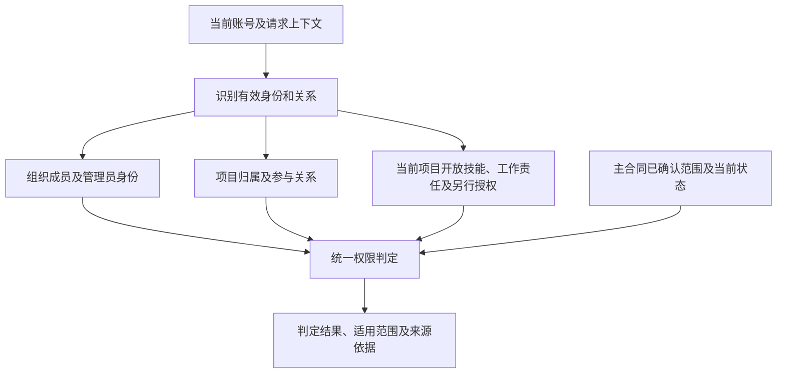

# FRAMEFORGE 权限架构设计

版本：1.3  
初始日期：2026-10-05  
本次修订：2026-10-06（Asia/Shanghai）  
状态：身份层级按[权限规则](PERMISSION_RULES_2026-10-05.md)，成员生命周期按[组织规则](USER_TEAM_AGENCY_RULES_2026-10-05.md)；编辑范围、协作及项目可见性按2026-10-06本轮最新用户确认更新。本版只设计架构，尚未实施。

文件路径继续使用 `next-generation/requirements/PERMISSION_ROLE_MODULE_MATRIX_2026-10-05.md`，保持既有引用。本版不编排模块、按钮、具体功能点或139岗位的授权矩阵，不维护第二份权限合同。

## 1. 依据与范围

本文件负责说明主合同中的身份、作用域、组织管理关系、项目归属、项目参与、工作分配及权限生命周期如何连接。

依据：

- [权限规则](PERMISSION_RULES_2026-10-05.md)：身份层级及权限范围的主合同；本轮新确认覆盖相应旧概要，未解答部分继续按ACL编号保留。
- [用户、岗位、团队与Agency规则](USER_TEAM_AGENCY_RULES_2026-10-05.md)：组织关系、成员生命周期、能力展示、管理权移交、项目接收及归档的配套合同。
- [工种目录](JOB_CATALOG_DEFINITIONS_2026-10-05.md)：岗位定义的统一来源，不从岗位名称或知识分类推导管理身份。

本轮只修改当前文件，不改写上述来源文件、其他规划文档、代码、数据库或部署。主合同及组织文档中与本轮确认不同的旧表述尚未由本轮同步；实施时以最新明确用户决定为准，不把旧概要与新确认并列为两套规则。

## 2. 身份与作用域（主合同角色及本轮确认）

下表身份名称沿用权限规则第1节，不新增角色层；项目成员的编辑范围按本轮最新确认更新。查看、管理和对外授权按角色判定，不从技能范围自动推导。

| 身份 | 范围 |
| --- | --- |
| 个人用户 | 自己的账号、能力档案及个人项目 |
| 普通团队成员 | 所加入团队内的组织列表、展示技能和本人项目关系 |
| 项目成员 | 所参与项目的完整内容查看；编辑范围按本人在当前项目开放的技能确定；管理和对外授权按角色判定 |
| 独立团队管理员 | 唯一团队管理权，本团队所有项目管理 |
| Agency所属团队管理员 | 唯一本团队内部管理及本团队全部项目；不掌握所属团队建立/解散或脱离Agency功能 |
| Agency管理员 | 固定最高管理账号，所属全部团队及其内部项目；指派/改派团队管理员，创建/解散所属团队 |
| 系统最高管理员/知识后台 | 通过统一系统权限和用户组授权的知识维护动作管理岗位定义，不另设知识库专用角色；本轮未据此自动授予所有业务项目内容访问权 |

一个账号在不同范围可以具有不同身份。某人在甲团队拥有管理权，不因此管理乙团队；仅加入团队也不自动取得该团队全部项目内容权限。

“个人项目管理者”是个人用户管理本人个人项目的场景描述，沿主合同第4、5节处理，不额外建立一个项目管理员层。

“已离队用户”是成员关系变化后的状态，沿主合同第5、7节处理，不作为独立的当前管理身份。

系统最高管理员/知识后台沿主合同的统一系统权限及用户组授权范围处理，不另设知识库专用管理角色，也不据“系统最高”推断全部业务项目内容访问。

## 3. 角色层级与管理关系

层级表达已确认的管理范围和组织关系，不是账号之间永久固定的高低等级。系统治理、独立团队管理、Agency管理和项目参与分别说明。

```text
系统范围
└── 系统最高管理员/知识后台
    └── 主合同明确的系统及知识维护授权范围
        （不自动开放所有业务项目内容）

个人范围
└── 个人用户
    └── 本人账号、能力档案及个人项目

独立团队范围
├── 独立团队管理员：唯一管理员
│   └── 本团队内部事务及全部项目管理
└── 普通团队成员
    └── 参与具体项目后具有该项目的项目成员身份

Agency范围
├── Agency管理员：固定最高管理账号
│   └── 所属全部团队及团队内部项目
└── Agency所属团队
    ├── Agency所属团队管理员：本团队唯一管理员
    │   └── 本团队内部事务及全部项目管理
    └── 普通团队成员
        └── 参与具体项目后具有该项目的项目成员身份
```

该结构不新增组织或权限角色。项目归属、管理关系和参与关系分别记录，不能因图示层级把所有普通组织成员都变成项目成员。

### 3.1 独立团队

每团队唯一管理员，无额外管理员或部分管理授权。当前管理员可将全部管理权移交给现有团队成员，接收条件沿组织合同检查。

移交成功后，新管理员接手团队管理权，原管理员成为普通成员；双方既有项目工作责任不随管理身份自动变化。

### 3.2 Agency及所属团队

Agency有固定最高管理员，不可移交。Agency管理员管理所属全部团队及内部项目，可指派、改派所属团队的团队管理员。

每个所属团队仍只有一名团队管理员，管理本团队内部及全部项目。该身份不掌握所属团队建立、解散或脱离Agency的权力；组织边界按主合同第3节处理。

Agency管理员与所属团队管理员的范围来自主合同明确授权，不是由岗位、普通成员关系或项目参与关系推算。

## 4. 项目归属与管理来源

项目具有唯一归属。谁管理项目、谁参与项目和谁承担具体工作分别表达。

| 项目场景 | 已确认的管理来源 | 与参与、工作责任的关系 |
| --- | --- | --- |
| 个人项目 | 创建该个人项目的用户管理本人项目 | 沿个人用户身份；不额外建立独立项目管理角色 |
| 独立团队项目 | 本团队管理员管理本团队全部项目 | 普通团队成员须有项目参与关系，不能仅因入队进入全部项目 |
| Agency所属团队项目 | 本团队管理员管理本团队全部项目；Agency管理员管理全部所属团队及项目 | 两种已确认管理范围均保留；普通成员的项目参与关系另行记录 |

团队项目由具有对应管理权限的管理员创建。个人项目转入团队须由目标团队管理员确认接收，确认前保持原归属；确认后直接成为团队项目，按团队/Agency规则管理，不额外办理管理权转交，不形成永久并列个人管理权。

其他跨团队整体转移或退回个人归属，主合同尚未决定，本版不新增流程。

不能把团队/Agency管理员的“管理全部所属项目”收窄为仅有一个管理入口，也不能要求其先取得额外项目角色才承认主合同已确认的管理范围。“可管理”具体包含哪些细粒度能力，仍由主合同的确认状态决定，不自动补齐功能权限。

## 5. 项目参与、编辑范围与协作（本轮已确认）

- 普通团队成员不显示未参与的项目，也不因团队成员身份访问未参与项目内容。本轮取消原“查看全部可列出未参与项目”的概要。
- 项目成员的编辑范围按本人在当前项目开放的技能确定，不从完整个人能力档案、岗位名称或其他项目的开放记录自动取得范围。
- 查看、管理和对外授权按角色分别判定；编辑范围与这些能力分开计算。项目成员完整项目查看、团队/Agency管理员全部所属项目管理等已确认角色范围继续适用。
- 团队管理员、Agency管理员分别按其管理身份及所属范围判定，不以普通成员的“是否参与”替代管理身份，也不把普通成员隐藏未参与项目的规则用于剥夺其已确认管理范围。
- 对于多个成员当前项目开放技能所共同覆盖的内容，可以共同修改，保留操作人、修改历史及历史责任；内容不归某个填写者私有。
- 已离队用户保留个人历史摘要；历史项目内容默认不随摘要开放，需要另行管理员授权。

“当前项目个人开放的技能”是项目范围记录，与个人能力档案、团队展示能力和实际工作责任分别表达。来源按用户指定的组织合同：团队项目从本人在本团队已批准、有效展示的技能范围中选取，新增工作分配和交接不得使用未展示、未批准能力；个人项目沿本人能力档案和个人管理范围处理，不套用其他团队的批准。组织合同未明确的项目开放记录变化细则不另行补造。

本轮只确认范围来源和协作原则，不逐项定义技能对应模块、功能或字段。查看项目也不自动授予管理或对外授权。

## 6. 个人能力、团队展示、项目开放及工作责任

| 概念 | 架构含义 | 本轮边界 |
| --- | --- | --- |
| 个人能力档案 | 用户本人声明掌握的技能 | 不自动变成每个项目的编辑范围，不授予管理身份 |
| 团队有效展示能力 | 在某团队按组织规则生效的技能展示 | 新增工作分配及职责交接仍使用本团队有效展示技能 |
| 当前项目个人开放技能 | 本人向当前项目开放的技能范围 | 作为当前项目编辑范围依据；技能资格与工作分配按组织合同处理 |
| 正式工作责任 | 管理员分配、调整及交接的实际责任 | 与可编辑范围分开；共同编辑不自动改写主责、历史或执行事实 |
| 角色身份 | 在系统、个人、团队、Agency或项目范围内的有效身份 | 决定对应的查看、管理及对外授权，不按技能推算角色 |

架构关系为：

```text
当前项目个人开放技能
    → 当前项目对应内容的编辑范围
    → 重合范围允许成员共同修改，并保留历史

当前有效角色
    → 角色范围内的查看、管理及对外授权
    → 不由技能多少、岗位名称或编辑能力推导

本团队有效展示能力
    → 新增正式工作分配及职责交接的资格依据
    → 团队项目开放技能的来源按组织合同处理
```

管理员依据本团队最新有效展示能力分配、调整工作；成员申请增减正式责任由管理员批准后生效。分配或交接不得使用未展示、未批准的团队能力。

个人能力删除或停止团队展示，不自动改写已完成或正在进行项目的原分工；新增分工使用最新有效能力，历史责任与执行事实继续保留。

项目开放技能的资格来源及工作分配沿组织合同处理，不增加新的审批角色或把团队能力批准重复设为另一层管理身份。当前项目有效开放范围用于编辑判定；责任与历史保留不表示编辑权永久不变。组织合同未明确的项目记录变更细则保留待设计，不在本轮新增流程。

139岗位仍按工种目录引用。一人多岗、一岗多人允许，不因此产生新的管理等级或角色。

## 7. 统一鉴权架构（设计提案）

按主合同的统一身份/项目鉴权方向，采用一个权威身份及成员关系来源、一个统一权限判定口径。以下说明架构职责，不指定部署、表名、接口或权限代码键。



判定要求：

- 根据目标项目所属范围识别当前有效身份，不按账号全局比较一个“最高等级”。
- 查看、管理及对外授权依据有效角色；编辑依据本人当前项目开放技能。保留个人、团队、Agency管理来源和项目参与/技能范围的区别。
- 不因个人档案中的能力名称、工种大类、页面排列或数据作者自动生成权限。开放技能只在当前项目对应编辑范围中生效，不推导管理身份或对外授权。
- 普通组织成员关系不泛化为内容授权；已确认团队/Agency管理员范围作为明确来源处理。
- Work/Episode仅组织项目，不产生授权。
- 身份和授权变更后，对后续请求、已有连接、缓存和未完成作业重新校验，不能继续依赖过期关系。
- 记录判定所依据的角色、关系、当前项目开放技能、工作责任或另行授权，供审计回查。

本版不使用此前“组织身份＋Project Admin＋Lead＋跨职责授权＋自定义模板”的公式作为正式授权结构。主合同未定义的角色或授权来源，不据旧公式自动恢复。

ACL-02按用户指定的组织合同第15.2节处理：保留团队/Agency管理员管理全部所属项目的已确认范围，也保留普通项目授权的明确拒绝规则。原文仍将两者冲突时的优先级列为待确认；不以旧泛化拒绝规则抹去管理员范围，也不据概要新增绕过拒绝的规则。

## 8. 生命周期、离队与历史

项目归属、管理权移交、成员关系和历史记录沿组织合同处理。ACL-06按用户指定，以组织合同为依据，不自行增加平行成员身份或未经确认的联动规则。

最新组织合同第10节已明确：“用户主动退出不需要管理员批准，被移除需管理员操作。”本轮以此及用户明确回复“主动离队不需要管理员批准，无需办理额外授权”区分主动离队与管理员移除，离队后通知管理员。

- 主动离队不需要管理员批准，也无需办理额外授权；不能因没有接收人或能力缺口阻断离队。
- 处理时将未完成职责交给现有成员，依据其在本团队有效展示的技能，不使用未展示能力。
- 无人能接手或胜任时，缺口持续标红提醒管理员和团队成员，不伪造接收人、技能或完成记录。
- 离队不清除历史责任和执行事实；所有离队成员保留个人历史摘要。
- 团队管理员本人先按组织合同第7节完成管理权移交，再办理退出；Agency所属团队的接任沿Agency指派规则。
- 历史项目内容默认不随摘要继续开放，需要管理员另行明确授权；离队无需审批与离队后内容访问需授权分别处理。

组织文档仍有“批准后正式离队”等旧文字，与其最新“主动退出无需批准”并存。本版不将旧批准文字恢复为主动离队门槛；该处原文尚未由本轮改写。

其他生命周期边界：

| 变化 | 已确认架构边界 | 仍需明确部分 |
| --- | --- | --- |
| 个人项目进入团队 | 接收后唯一归属目标团队，按团队/Agency管理，不保留永久并列个人管理权 | 不新增额外转交流程 |
| 独立团队管理权移交 | 新管理员接手全部管理权，原管理员成为普通成员；既有工作责任不自动变化 | 按新的有效角色检查范围 |
| Agency所属团队管理员变更 | Agency指派/改派，Agency最高管理身份不移交 | 不新增独立项目管理员层 |
| 个人技能/团队展示变化 | 原分工和历史保持，新增分工按最新有效展示能力 | 对当前项目开放技能及编辑范围的联动待明确 |
| 项目成员变化 | 按组织合同处理有效关系，历史责任保留 | 组织合同未明确的细则保持待定 |
| 团队/Agency解散 | 项目及历史归档，停止团队协作，内容保留；原管理账号按归档规则处理 | 归档后授权范围及资格延续细则未新增确认 |

历史成员、历史管理员、创建历史或历史作者身份不自动成为当前授权。

## 9. 边界确认状态

| 编号 | 本轮确认 | 仍未解答 |
| --- | --- | --- |
| ACL-01 | 编辑范围按当前项目个人开放技能确定；重合范围可共同修改，保留操作人和修改历史；技能资格来源按组织合同 | 具体技能对应内容的后续定义；组织合同未明确的项目记录变更细则 |
| ACL-02 | 按用户指定，以组织合同第15.2节为准；保留已确认管理员范围，不新增绕过拒绝规则 | 原文仍保留明确拒绝与管理员范围冲突时的优先级待确认 |
| ACL-03 | 编辑依据项目开放技能；查看、管理、对外授权按角色分别判定 | 各角色的具体能力清单，本轮不设计功能 |
| ACL-04 | 普通团队成员不显示未参与项目，不提供原“查看全部”的未参与项目列表 | 不再询问未参与项目的展示字段；现有管理员角色范围不变 |
| ACL-05 | 主动离队无需管理员批准并通知管理员；交接缺口不阻断离队；历史内容需管理员另行授权 | 归档后资格延续等原合同未定细则 |
| ACL-06 | 按用户指定以组织合同为依据，当前身份、工作责任和历史分别处理 | 合同未明确的具体联动不由本版自动补齐 |

用户已指定ACL-02按组织合同处理，本版直接引用第15.2节的边界，不重复提出同一选择题。引用该合同不表示其仍标为待确认的拒绝冲突优先级已定案；未明确的生效或联动规则不自动写成允许、拒绝或审批要求。

## 10. 修订记录与检查

### 10.1 版本1.2：角色层级对齐

按用户要求以权限规则为角色主合同，沿用七项身份及明确组织管理范围；不额外设置Project Admin、Responsibility Lead、Responsibility Member、Talent、Client Reviewer或Guest / Share Visitor层级，不以旧权限公式建立另一套角色体系。

### 10.2 版本1.3：边界确认

本轮根据2026-10-06用户回复更新：

- 编辑范围改为当前项目个人开放技能；同范围成员允许共同修改并保留历史。
- 查看、管理及对外授权按角色分别判定，不从开放技能自动推导。
- 普通团队成员隐藏未参与项目，覆盖旧合同的“查看全部可列出未参与项目”表述。
- 主动离队及通知、交接缺口、历史保留和另行管理员内容授权分别记录，采用最新组织合同的无需批准原则。
- 项目开放技能的资格来源及ACL-06按用户指定的组织合同；主动离队无需批准或额外授权已获明确回复。
- ACL-02按用户最新指定，以组织合同第15.2节为准；保留原文的管理员范围及拒绝冲突待定边界。

七项角色名称与管理层级保持；未新增功能点、模块映射、逐岗位授权表或中间职责节点。当前项目编辑范围、正式责任及角色能力分别表达。

本轮仅更新当前架构文档。权限主合同及组织文档中的旧概要需后续同步，本版通过上述确认状态及来源说明标明差异，未宣称来源文件已全部一致。

本次仅修订本文件，未修改主合同、组织合同或应用；未执行运行鉴权、成员变更或组织操作。本文件及示意图不代表权限架构已实现、测试或上线。
