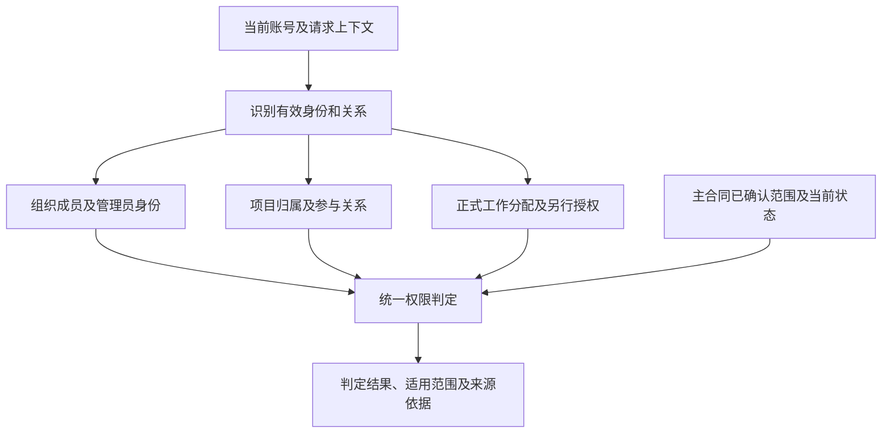

# FRAMEFORGE 权限架构设计

版本：1.2  
初始日期：2026-10-05  
本次修订：2026-10-06（Asia/Shanghai）  
状态：按用户最新要求，以[权限规则](PERMISSION_RULES_2026-10-05.md)为主合同，身份层级、管理范围和待确认边界均按该合同展开。本版只设计架构，尚未实施。

文件路径继续使用 `next-generation/requirements/PERMISSION_ROLE_MODULE_MATRIX_2026-10-05.md`，保持既有引用。本版不编排模块、按钮、具体功能点或139岗位的授权矩阵，不维护第二份权限合同。

## 1. 依据与范围

本文件负责说明主合同中的身份、作用域、组织管理关系、项目归属、项目参与、工作分配及权限生命周期如何连接。

依据：

- [权限规则](PERMISSION_RULES_2026-10-05.md)：身份和权限范围的主合同；已确认内容按原文，未决内容按ACL-01—ACL-06保留。
- [用户、岗位、团队与Agency规则](USER_TEAM_AGENCY_RULES_2026-10-05.md)：组织关系、成员生命周期、能力展示、管理权移交、项目接收及归档的配套合同。
- [工种目录](JOB_CATALOG_DEFINITIONS_2026-10-05.md)：岗位定义的统一来源，不从岗位名称或知识分类推导管理身份。

本轮只修改当前文件，不改写上述来源文件、其他规划文档、代码、数据库或部署。

## 2. 身份与作用域（按主合同已确认）

下表直接沿用权限规则第1节的身份名称和范围：

| 身份 | 范围 |
| --- | --- |
| 个人用户 | 自己的账号、能力档案及个人项目 |
| 普通团队成员 | 所加入团队内的组织列表、展示技能和本人项目关系 |
| 项目成员 | 所参与项目的内容查看，分配给自己的工作编辑 |
| 独立团队管理员 | 唯一团队管理权，本团队所有项目管理 |
| Agency所属团队管理员 | 唯一本团队内部管理及本团队全部项目；不掌握所属团队建立/解散或脱离Agency功能 |
| Agency管理员 | 固定最高管理账号，所属全部团队及其内部项目；指派/改派团队管理员，创建/解散所属团队 |
| 系统最高管理员/知识后台 | 通过统一系统权限和用户组授权的知识维护动作管理岗位定义，不另设知识库专用角色；本轮未据此自动授予所有业务项目内容访问权 |

一个账号在不同范围可以具有不同身份。某人在甲团队拥有管理权，不因此管理乙团队；仅加入团队也不自动取得该团队全部项目内容权限。

“个人项目管理者”是个人用户管理本人个人项目的场景描述，沿主合同第4、5节处理，不额外建立一个项目管理员层。

“已离队用户”是成员关系变化后的状态，沿主合同第5、7节处理，不作为独立的当前管理身份。

系统最高管理员/知识后台沿主合同的统一系统权限及用户组授权范围处理，不另设知识库专用管理角色，也不据“系统最高”推断全部业务项目内容访问。

## 3. 角色层级与管理关系

层级表达已确认的管理范围和组织关系，不是账号之间永久固定的高低等级。系统治理、独立团队管理、Agency管理和项目参与分别说明。

```text
系统范围
└── 系统最高管理员/知识后台
    └── 主合同明确的系统及知识维护授权范围
        （不自动开放所有业务项目内容）

个人范围
└── 个人用户
    └── 本人账号、能力档案及个人项目

独立团队范围
├── 独立团队管理员：唯一管理员
│   └── 本团队内部事务及全部项目管理
└── 普通团队成员
    └── 参与具体项目后具有该项目的项目成员身份

Agency范围
├── Agency管理员：固定最高管理账号
│   └── 所属全部团队及团队内部项目
└── Agency所属团队
    ├── Agency所属团队管理员：本团队唯一管理员
    │   └── 本团队内部事务及全部项目管理
    └── 普通团队成员
        └── 参与具体项目后具有该项目的项目成员身份
```

该结构不新增组织或权限角色。项目归属、管理关系和参与关系分别记录，不能因图示层级把所有普通组织成员都变成项目成员。

### 3.1 独立团队

每团队唯一管理员，无额外管理员或部分管理授权。当前管理员可将全部管理权移交给现有团队成员，接收条件沿组织合同检查。

移交成功后，新管理员接手团队管理权，原管理员成为普通成员；双方既有项目工作责任不随管理身份自动变化。

### 3.2 Agency及所属团队

Agency有固定最高管理员，不可移交。Agency管理员管理所属全部团队及内部项目，可指派、改派所属团队的团队管理员。

每个所属团队仍只有一名团队管理员，管理本团队内部及全部项目。该身份不掌握所属团队建立、解散或脱离Agency的权力；组织边界按主合同第3节处理。

Agency管理员与所属团队管理员的范围来自主合同明确授权，不是由岗位、普通成员关系或项目参与关系推算。

## 4. 项目归属与管理来源

项目具有唯一归属。谁管理项目、谁参与项目和谁承担具体工作分别表达。

| 项目场景 | 已确认的管理来源 | 与参与、工作责任的关系 |
| --- | --- | --- |
| 个人项目 | 创建该个人项目的用户管理本人项目 | 沿个人用户身份；不额外建立独立项目管理角色 |
| 独立团队项目 | 本团队管理员管理本团队全部项目 | 普通团队成员须有项目参与关系，不能仅因入队进入全部项目 |
| Agency所属团队项目 | 本团队管理员管理本团队全部项目；Agency管理员管理全部所属团队及项目 | 两种已确认管理范围均保留；普通成员的项目参与关系另行记录 |

团队项目由具有对应管理权限的管理员创建。个人项目转入团队须由目标团队管理员确认接收，确认前保持原归属；确认后直接成为团队项目，按团队/Agency规则管理，不额外办理管理权转交，不形成永久并列个人管理权。

其他跨团队整体转移或退回个人归属，主合同尚未决定，本版不新增流程。

不能把团队/Agency管理员的“管理全部所属项目”收窄为仅有一个管理入口，也不能要求其先取得额外项目角色才承认主合同已确认的管理范围。“可管理”具体包含哪些细粒度能力，仍由主合同的确认状态决定，不自动补齐功能权限。

## 5. 项目参与和工作范围

按主合同第5节：

- 未参与目标项目的普通团队成员，可以按“查看全部”的列表规则识别项目，但不可进入项目内容。
- 目标项目成员可以查看完整项目，仅编辑分配给自己的工作。
- 团队管理员、Agency管理员分别按主合同规定的完整所属管理范围判定，不以普通项目成员参与条件替代其管理身份。
- 已离队用户保留个人历史摘要；原团队/项目关系不自动保留访问或编辑，项目内容需另行授权。

“分配给自己的工作”是已确认的范围原则；具体按什么业务对象或范围表达，仍属于ACL-01。此处不预设Task、Shot、字段或项目岗位职责中的某一种为唯一权限模型。

本版不再直接认定“岗位一经任职即可编辑整个项目同职责内容”，也不从“同职责”直接推导互相编辑范围。此前相关表述与主合同的衔接，归ACL-01后续确认，不作为已生效的架构例外。

完整项目查看与其他能力分开判定；本版不因查看范围明确而补齐具体功能授权。

## 6. 能力、任职与授权分别记录

个人能力、团队有效展示、团队需求、项目工作分配及组织管理身份不是同一概念。

架构关系为：

```text
个人能力
    ↓ 用户向某团队提交展示，按组织合同生效
该团队的最新有效展示能力
    ↓ 对应管理员据此组队、分配或交接
项目中的正式工作分配
    ↓ 按主合同及待确认粒度表达
成员自己的工作范围

当前有效管理身份
    → 独立提供主合同明确的管理范围
    → 不由技能或专业岗位名称产生
```

管理员依据最新有效展示能力分配、调整工作，成员申请增减责任由管理员批准后生效。未批准、未展示的能力不能作为新增分配或交接依据。

个人能力删除或停止展示不自动修改已完成或正在进行项目的原分工；新项目及已有项目新增分工使用最新有效能力。组织管理员身份变更也不自动改写项目职责或执行历史。

139岗位仍按工种目录引用。一人多岗、一岗多人允许，但岗位数量不形成管理等级，岗位名也不直接产生某一治理身份。

## 7. 统一鉴权架构（设计提案）

按主合同的统一身份/项目鉴权方向，采用一个权威身份及成员关系来源、一个统一权限判定口径。以下说明架构职责，不指定部署、表名、接口或权限代码键。



判定要求：

- 根据目标项目所属范围识别当前有效身份，不按账号全局比较一个“最高等级”。
- 保留个人、团队、Agency管理来源和项目参与/工作范围的区别。
- 不按能力名称、工种大类、页面排列或数据作者自动生成权限。
- 普通组织成员关系不泛化为内容授权；已确认团队/Agency管理员范围作为明确来源处理。
- Work/Episode仅组织项目，不产生授权。
- 身份和授权变更后，对后续请求、已有连接、缓存和未完成作业重新校验，不能继续依赖过期关系。
- 记录判定所依据的身份、关系、工作分配或另行授权，供审计回查。

本版不使用此前“组织身份＋Project Admin＋Lead＋跨职责授权＋自定义模板”的公式作为正式授权结构。主合同未定义的角色或授权来源，不据旧公式自动恢复。

普通项目授权的明确拒绝规则保留；其与团队/Agency管理员范围冲突时的优先级仍属ACL-02，不能自行绕过拒绝，也不能未经确认剥夺已明确的组织管理范围。

## 8. 生命周期与当前有效身份

| 变化 | 按主合同保留的架构边界 | 后续判定与待确认衔接 |
| --- | --- | --- |
| 个人项目进入团队 | 确认前个人归属；接收后直接成为团队项目，按团队/Agency管理 | 不自行增加永久并列个人管理身份或额外转交流程 |
| 独立团队管理权移交 | 新管理员接手全部团队管理权，原管理员成为普通成员；项目职责保持 | 具体访问按新的有效身份检查 |
| Agency所属团队管理员变更 | 由Agency管理员指派/改派，Agency最高管理身份不移交 | 不据此新增项目管理角色层 |
| 能力/展示变化 | 既有分工及历史不重算，新增分工使用最新有效能力 | 自己工作范围的表达沿ACL-01 |
| 退出/移除 | 审批期间仍为正式成员；获批离队，历史事实及个人摘要保留 | 项目成员联动与另行授权沿ACL-05、ACL-06 |
| 项目成员新增/移除 | 当前访问按有效身份变化，不自动清除历史责任 | 与团队成员关系的联动沿ACL-06 |
| 团队/Agency解散 | 项目及历史归档，停止团队协作，内容保留；原管理账号按归档规则处理后续访问 | 归档授权及后续状态细则沿ACL-05及主合同第7节 |

历史成员、历史管理员、创建历史或历史作者身份不自动成为当前授权。

## 9. 待确认边界（引用主合同，不自行关闭）

| 编号 | 架构中的待确认边界 | 本轮处理 |
| --- | --- | --- |
| ACL-01 | “自己的工作”范围如何表达，多人负责同一内容如何区分 | 保留待确认，不预设整项目职责协作或任务/镜头逐项授权 |
| ACL-02 | 明确拒绝与团队/Agency管理员范围的优先级 | 保留待确认，不自动绕过或撤销管理范围 |
| ACL-03 | 查看、工作编辑与其他能力的边界 | 不展开功能清单，不从身份或概述自动补齐 |
| ACL-04 | 未参与项目列表与内容边界 | 保留待确认，本版不设计字段投影 |
| ACL-05 | 离队或归档后另行授权的主体及范围 | 保留待确认，不按历史身份恢复访问 |
| ACL-06 | 团队成员和项目成员生命周期如何联动 | 保留待确认，不将入队与入项目合并为同一关系 |

主合同中标为“建议方向，尚未确认”的内容仍是建议。本版不将建议、未回答的问题或此前规划中的推断写成默认规则。

## 10. 与上一版的衔接及本次检查

2026-10-06用户进一步明确：“角色层级也按照PERMISSION_RULES_2026-10-05.md来，修改当前文档”。本版据此调整：

- 身份名称、层级关系和作用域按主合同第1、3、5节组织。
- 将团队/Agency管理员管理全部所属项目的范围恢复为主合同的明确授权。
- 个人项目管理沿个人用户身份及项目归属表达。
- Project Admin、Responsibility Lead、Responsibility Member、Talent、Client Reviewer、Guest / Share Visitor不再作为本版独立正式角色层；不保留其原角色权限表。
- 此前项目自定义权限模板和由Lead承担跨职责审批的结构，不再作为当前已确认的授权来源或审批层级。
- 工作范围按主合同保留“仅编辑分配给自己的工作”；与此前职责协作规划的衔接保持待确认。
- ACL-01—ACL-06继续按主合同记录，不因旧规划已有表述而自动关闭。
- 功能点、模块映射、逐岗位授权表和44个中间职责节点继续不纳入本版。

此前确认及旧稿仍可通过历史版本回查，但不能与本次指定的主合同并列形成另一套现行角色层级。若后续需扩展角色或承接旧稿中的具体规则，应先明确主合同中的位置和边界，不在架构文档中自行追加。

本次文档检查：七项正式身份名称和范围与主合同逐行一致；新增角色未进入身份表或层级图；管理范围与项目参与关系区分；待确认项未自动定案；未新增功能点授权矩阵。

本次仅修订本文件，未修改主合同、组织合同或应用；未执行运行鉴权、成员变更或组织操作。本文件及示意图不代表权限架构已实现、测试或上线。
