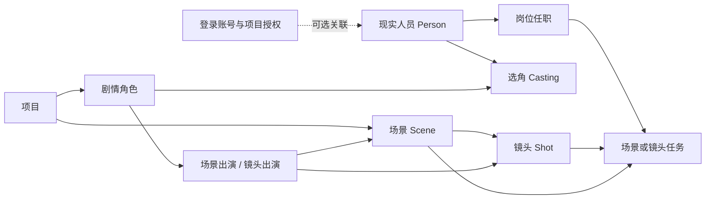

# 岗位工作流、角色工作台与演职人员联动需求

日期：2026-10-03（Asia/Shanghai）。类型：需求整理与产品提案，**仅文档，无实现或验收完成声明**。

检查基点：本地 `master @ 9e1f69c8daad9b0aed0297c8c60947cadc71acd7`，同时只读检查并行代理的未提交画板、导入及工程文件增量。此处是历史盘点，不代表最新代码状态。本文不替代既有 canonical 方案，不授权生产操作。最新实施顺序见 [扩展性实施计划](EXTENSIBILITY_IMPLEMENTATION_PLAN_2026-10-04.md)，当前接入缺口见 [后端与前端衔接账本](BACKEND_FRONTEND_HANDOFF_2026-10-04.md)。

## 1. 确认范围与提案边界

当前用户要求扩展尚未完成/验收的能力，并为工作岗位流程、工作台/视图/导出视图及演职人员与场景/镜头联动作深入需求设计；岗位工作流本轮只写文档。允许后续增加新模块前端，但必须保留已完成界面。下面的实体名称、默认模板、具体菜单位置、指标与权限细项是**建议合同，待产品确认与实现审查**，不能写成用户已逐项选定，更不能以本文充当实施完成证据。

必须遵守已有决定：

- 功能黄金基线 `5e86a0bb11a20ecd631d9c2af66260a73d7c92e7`；shadcn New York / neutral、根 `packages/ui`、用户截图与整行照片封面表现形式硬保留。新增工作台不能替换项目大厅、镜头表、Inspector、审片或原四项制作概览。
- 不恢复归档、独立 duplicate、精简/专业模式或全局审批看板；镜头行保留 Ctrl/Cmd+C/X/V 与右键向上/向下粘贴，默认 V 向下；整列沿用其已确认相对粘贴方向，不能把列方向写成镜头行方向。不增加产品 Reduced Motion 模式。
- 按 [列模型](COLUMN_MODEL_REQUIREMENTS_2026-10-02.md)保留 9 内置 /20 预设 /N 自定义。内置列可隐藏、软删除、恢复，不可 Purge；删除不清核心值。导出字段另有独立 allowlist。
- 按 [重构范围](VNEXT_REFACTOR_SCOPE_2026-10-02.md)分离内容版本、共享视图和独立审阅历史。共享视图无内容版本历史；情绪板不进入项目内容版本，但仍支持命令撤销。灯光内容需要进入项目内容版本。审片是独立模块，不将整个审阅活动复制进每次内容提交。
- VNext 以 `apps/api` / `apps/web` 为 owner；复用标准服务、事务、revision、审计与已有共享包。不迁旧数据库/旧工程数据，不兼容旧 API；只保留 Legacy 便携工程文件映射桥。

## 2. 当前代码基础，不能误认成完整岗位系统

| 基础 | 已读取的代码证据 | 可复用范围 / 明确缺口 |
| --- | --- | --- |
| 登录用户与角色 | `apps/api/app/models/user.py: User / Role`；`services/seed.py` | 有账号、全局权限 JSON、颜色。director/camera 等 seed 名称是当前认证角色，不是项目岗位任职、雇佣关系或剧情角色系统。未见项目成员/用户组完整授权 owner。 |
| 场景和镜头 | `models/production.py: Production / Sequence / Scene`；`models/shot.py: Shot.scene_id / sequence_id` | 实体层级存在；Scene 地点/内外景/日夜可复用。仅有 FK 不证明场景编辑、同项目校验、跨场景人员继承及可用消费者已齐。 |
| 制作步骤 | `models/shot.py: ProductionStep`；`services/shot_service.py` | 有镜头步骤、部门、负责人、输入/输出素材和状态，复制命令会复制步骤。未见模板 DAG、依赖失效、场景任务与多人任职命令闭环。 |
| 负责人和对白角色 | `Shot.owner_id` 是可空字符串；`column_catalog.py: dialogue_character` 为 pending | 不能将任意 owner 字符串认成真实 User/Person FK；不能把对白角色直接绑到账号或负责人。 |
| 工作视图 | `services/saved_view_service.py`；`components/shot/ShotSavedViews.tsx`；`overview/page.tsx` | 保存/应用视图有实际消费，概览有四项真实制作统计。角色工作台与指标读模型尚未形成。 |
| 内容、审阅与导出 | `project_snapshot.py` schema2；`review_service.py`；`document_export.py` | 有内容快照、独立批注水位/事件与普通文档字段 allowlist；这些基础不能证明岗位交接、演职隐私和角色导出已实现。 |

## 3. 四种“角色”必须分开

| 概念 | 身份和作用（提案） | 明确不能等同 |
| --- | --- | --- |
| Account / AuthRole | 登录账号、是否启用、组与项目权限；决定某次请求能做什么 | 担任导演不自动授予管理员；账号被停用不删除演职履历。 |
| BusinessPerson | 现实人员，可无账号；演员、配音、工作人员共用人员身份。账号关联可选且需明确授权 | 姓名、邮箱、备注或显示颜色不能作为稳定 identity，也不能自动合并同名人员。 |
| JobRole / Assignment | 项目/部门/场景/镜头/任务中的岗位任职，例如导演、摄影、灯光、剪辑；一人多岗、一岗多人 | 岗位是业务责任，权限仍由服务端另算；显示“摄影”不意味着能改全部镜头。 |
| CastCharacter / Casting | 剧情角色与现实演员的选角关系，按项目/版本/有效期表达；同演员可饰多角、同角可候选多人 | 剧情角色不是账号；选角候选不自动成为最终出演；对白角色不是镜头任务负责人。 |

演员、配音演员、替身/特技与工作人员可共享 Person，但其 Casting、JobAssignment 和 Appearance 分别建关系。匿名群众可用数量/组别表示，不强迫建立虚假账号。账号删除策略和人员业务删除策略独立；联系人信息的保留与 Purge 按隐私 scope 管理。

## 4. 场景、镜头、演职人员关系与唯一数据源

建议在现有层级上增加明确关系，而不是为每个部门复制一套镜头：



关系合同（提案）：

2026-10-04 补充：Scene ↔ Shot 已锁定为 0..N 多对多，以上示意连线不表示单父子归属。可不设主场景、最多一个主场景；主场景用于默认展示，镜头篇章独立。跨篇章场景关系显示差异，不自动修改镜头篇章。场景内排序与项目镜头排序分别维护。后续实现与验收以 [执行标准](EXTENSIBILITY_EXECUTION_STANDARD_2026-10-04.md) 为准。

1. 所有关系带 project scope 和稳定 ID。服务与适用复合 FK 同时阻止跨项目 Scene/Shot/Person/Asset 关系。镜号重排只改 display number，不改出演、任职、素材或任务目标。
2. Scene 的角色需求与 Shot 的实际出演分别保存。场景角色只是候选继承来源，不默认每镜头都出演。Shot 可覆盖“不在画面/仅声音/背景/替身”，UI 标出继承/明确指定及来源 revision；切场景先显示差异与确认。
3. “对白角色”预设可成为 Character 引用投影，但要先确定多角色对白的稳定段落 ID、说话人、文本和顺序；仍保留未解析来源文本。新增角色关系不创建第二份权威对白。未绑定文本进入待映射队列，不能靠姓名相似自动选角。
4. Scene 地点/内外景/日夜与 Shot 特例分开。继承使用源 ID/revision 和显式 override；不把 Scene 更新复制到每个 Shot 的隐藏 JSON。Shot 无 Scene 时可独立编辑，并标识尚未归场。
5. 岗位任职按项目/场景/镜头/任务确定 scope、有效期与主责/协作。查阅任务时计算适用任职，不把人员名单字符串复制到所有任务。Scene 任务被多个镜头引用时只建立一次，完成它可以解除多个镜头依赖。
6. 跨项目复用人员必须通过受控关联或新建项目记录；默认不泄露其他项目的联系人、合同或档期。人员合并先列影响关系、revision 和冲突，不能覆盖原角色出演历史。
7. 删除 Scene/Shot 的影响预览列出出演、任务、画板与交付依赖。软删除可恢复；Purge 通过 tombstone/ledger 阻止命令历史、版本、缓存、工程导入重放复活。角色/人员的历史如何纳入内容版本需另定 codec，私人联系人不默认进入内容提交。

## 5. 工作流模板与任务 DAG

### 5.1 模板与实例

建议模板包含稳定 node key、适用制作方式/岗位、输入定义、输出要求、依赖边与条件。实例固定 template version，指向 Scene 或 Shot 及其制作组件；模板更新提供迁移预览，不能悄悄重写进行中的任务、历史交接或完成标准。跨镜头共享的场景准备任务作为单实例依赖，不展开成 N 份状态。

模板保存时校验重复 node、缺失目标、循环依赖、跨项目引用与不可满足条件；用拓扑关系决定可开始状态，不用数组顺序假装依赖。模板 node ID 与 ProductionStep ID 需明确映射。现有 ProductionStep 是镜头制作组件基础，后续任务编排应引用/扩展它，不并存两个权威完成状态。

建议可选模板示例，**尚非已批准默认配置**：

| 模板 | 示例依赖链 | 产物与交接 |
| --- | --- | --- |
| LIVE | 场景拆解 → 演员/服化道/器材准备 → 排练/灯光与机位 → 拍摄 → 素材校验 → 剪辑 | 灯光画板和机位引用、拍摄素材版本、镜头清单；场景准备可被多镜头共享。 |
| STOCK | 素材需求 → 检索/候选 → 授权确认 → 素材交付 → 剪辑 | 授权状态与素材版本；没有授权交付不得自动置为可用。 |
| AE / VFX | 上游素材 → 设计/合成 → 版本输出 → 独立审片决定 → 修订或交付 | 输入版本、输出 AssetVersion、审阅对象 revision；同镜头同时 AE/VFX 是两个任务分支。 |
| VO / 配音 | 文稿与角色 → 配音选角 → 录音/TTS → 校准时长 → 音频交付 | 真人录音或实际 TTS 音频及语言/voice/rate；估算时长不能冒称实测。 |

### 5.2 状态与命令

建议任务状态为待开始、可开始、进行中、受阻、待交接、完成、跳过/取消；具体枚举待确认。“过期”是相对于输入版本的有效性状态，不能覆盖任务原完成事实。阻塞原因记录缺输入、依赖未完成、权限、人员/素材问题，不能把全部失败统一显示为进度 0。

开始/分派/转派/提交产物/确认交接/撤回/重开/跳过均走标准 command，验证角色权限、依赖、target revision、command ID、事务、audit 与 outbox；重复发送返回同 receipt。跳过须有理由和权限，且满足下游输入要求；不能以跳过绕过必须授权的素材或审阅。账号权限与任务责任变化都在服务端即时重验。

交接指向明确输入、产物版本与交接人；任务完成不能直接将 Shot 的 status 或 approval_status 改为全镜批准。审片决定由独立 Review owner 作出，任务只引用其结果和被审阅 revision。不重新建全局审批看板。

### 5.3 过期与修改传播

产物、审阅、交接和 job 绑定 content revision/输入 digest/模板版本。上游改对白、图片、镜头时长、灯光或角色出演时，按声明依赖将受影响任务标为需核对，保留已发生的交接；无关备注/共享视图变化不应使全部交付过期。旧 job 返回时重验 source revisions、permission epoch 和 purge epoch，过期结果不能自动覆盖当前内容。

变更预览应区分：输入已更新、需要重新制作、只需重新审阅、无需处理。建议允许授权者确认“继续使用旧产物”，记录理由和固定版本；不能把这种人工例外当作自动同步。取消 job 只阻止发布，不声称撤回已下载文件。

## 6. 岗位工作台与视图

新增入口位置与路由是提案，实施时与既有页面 owner 协调。工作台在当前项目内读取任务/场景/镜头，个人跨项目集合必须逐项目鉴权。不得覆盖整行照片大厅或重写既有表格/审片布局。

| 建议视图 | 主要问题 | 数据与动作 |
| --- | --- | --- |
| 我的工作 | 我现在能做什么、下一步交给谁 | 本人任职/分派任务、依赖就绪、期限、输入/产物、受阻原因；定位原 Scene/Shot/Review。 |
| 导演/制片 | 哪些场景未准备、哪些制作被阻塞 | 场景准备、镜头状态、人员需求、依赖和交接；没有预算数据时不生成预算 KPI。 |
| 摄影/灯光 | 当前镜头与场景所需机位/器材/灯光是否一致 | 原 Shot 摄影字段、灯光对象/画板及固定 revision；直接进入已有编辑 owner。 |
| 演员/选角/现场 | 哪些角色出演、人员是否确定、场景要求是什么 | Scene/Shot Appearance、Casting 状态、允许读取的拍摄信息；私人电话、合同金额不混入普通列表。 |
| 剪辑/AE/VFX/声音 | 上游素材是否齐、哪些输出需要重做 | 输入/输出资产版本、AE/VFX 多分支、文稿/音频、审片反馈和过期提示。 |
| 导出视图 | 此交接对象实际能拿到哪些数据 | 从角色投影选择镜头范围、字段、产物及交付模板；预览与成品共用服务器范围。 |

桌面主工作面建议包含可切换任务/场景/镜头读视图、筛选和排序、右侧引用详情。任务卡只是 read model；从卡片编辑必须调用原业务命令。多角色查看使用去重稳定 ID，同一镜头可在多个部门出现，状态保持一致。无数据、无权限、加载失败、确无待办分开显示。

视图定义包含过滤、分组、字段与尺寸；个人临时搜索/选择/滚动不影响所有用户。持久共享显示复用 SavedView owner，并保留 expected revision、ack、冲突草稿和实时失效。共享视图不进入项目内容历史，导出模板不借共享视图充当交付权限。

## 7. 指标分母与重复计数

以下指标是建议；批准前不增加到原四项制作概览。服务端返回分子、分母、scope、source revision、计算时间与口径版本，列表下钻使用同一过滤条件。项目总量不得用当前虚拟列表、分页、个人搜索结果估计；权限受限时写“可见范围”，不冒称项目全量。

| 指标提案 | 分子 / 分母与边界 |
| --- | --- |
| 镜头完成率 | 当前有效完成条件满足的 distinct 活动 Shot / scope 内 distinct 活动 Shot；回收镜头不计，0 分母显示“暂无镜头”，不显示 100%。 |
| 岗位任务完成率 | 有效完成的必需任务 / 必需任务；共享 Scene 任务只计一次。跳过/取消另列，是否排除需冻结口径，不能计成完成；过期产物另列。 |
| 可开始/受阻/超期 | 可开始、受阻或到期未完成任务的稳定 ID 集合；受阻按任务计一次、多原因可分组；期限用明确时区，无期限不算超期。 |
| 演出准备度 | 已确认选角且满足必要准备的角色需求 / 要求选角的角色需求；一个角色多演员候选不增分母，同演员多角按角色需求计。 |
| 待审产物 | 指向明确 AssetVersion/content revision 的待审提交；一个线程多评论不算多个待审产物。本人未读评论与项目待审总数分开。 |
| 交付就绪率 | 有产物、有效审阅及授权、未过期的交付项 / 必须交付项；生成成功和用户已下载/确认接收是不同事实。 |

保留现有概览 AE + VFX 相加的制作任务口径，不把它改成 distinct Shot 总量。新指标的“任务”若来自 DAG 实例，必须和既有制作方式分组数字区分单位；重命名或替换原统计需要单独确认。

## 8. 权限、隐私与导出 allowlist

权限合同建议为：账号有效性 ∩ 项目 membership ∩ 项目/组 capability ∩ 对象/字段 scope ∩ 分享 grant ∩ 当前期限与撤销状态。岗位模板不自动授予 capability，演职 Person 没有账号时不拥有登录权限。显式拒绝、组继承优先级和人员关联的默认权限待确定。

建议 capability 分为任务读/分派/转派/操作、工作流模板管理、人员基本资料/联系人/选角读取、演职编辑、Review 操作、共享视图写、导出/分享；实现复用一个 permission service，不散落角色名称比较。服务器覆盖详情/列表/搜索/指标计数、媒体、历史版本、WS 房间、预览和下载；隐藏按钮不能代替鉴权。

隐私建议分三层：制作协作资料（姓名/岗位/角色关系）、受限联系资料（电话/邮箱/档期）、高度受限资料（合同、证件、薪酬等，仅在未来明确授权新增）。后二者默认不在共享视图、日志、内容快照、QR/ZIP、工作流说明或普通导出中。是否引入敏感字段本身是产品提案，本文不要求本轮收集。

导出授权的最终范围：

```text
可交付字段 = active catalog ∩ 用户权限 ∩ 对象/隐私 scope ∩ 本次勾选字段 ∩ 分享 grant（如有）
可交付对象 = 允许项目/Scene/Shot/任务范围 ∩ 本次全部/选中/筛选选择
```

项目内容快照不作为导出输入的无条件全集。PDF 正文、Word/XLSX/CSV、图片、预览、工程 QR/DM、ZIP 附件及引用历史都使用同一经授权投影。排除人物联系人时不能在附件、文件名、隐藏 JSON 或媒体 metadata 中泄露；取消画面时也不得仍附原图。协议必需 EDL/OTIO/SRT 数据保持独立标注和授权检查。

交付模板以稳定字段/关系 ID 保存字段、范围与版式；权限撤销、字段 Purge、角色关系删除或 job 输入更新后，旧模板重新规范化并提示缺项。发布 worker 和下载入口均重验权限/purge epoch。可见水印设置和强制隐写追溯复用交付 owner；hash/二维码不是隐写。

## 9. 交付、历史和撤销边界

任务提交的输出固定 AssetVersion/MediaPresentation 或工程 artifact ID；交接保存 scope、所用内容 revision、接收角色范围、生成状态与确认事实。共享视图改变不产生内容版本；批注解决不改写原内容提交。未来角色/任务关系进入内容快照的范围与独立活动历史必须逐实体声明，不能将人员私人档案直接纳入 schema2。

任务分派、出演关系修改、普通删除和可撤销的内容命令纳入持久命令 journal；失败不移动游标，分叉清 redo，跨域恢复有原子权限/revision 校验。Purge 和已外发副本不能由 undo 复活或自动撤回。浏览器本地拖动/表单撤销与服务器持久 undo 分开呈现，以 ack 作为保存事实。

## 10. 实施顺序与具体验收

顺序建议：现有项目授权/命令和 Purge 基础 → Scene/Shot 关系校验及预设语义 → Person/Character/Assignment/Appearance → 模板与 DAG → 岗位工作台 → 指标与角色导出 → 多用户/恢复/隐私验收。不要阻塞并行画板、导入和工程文件代理，也不要将其未验收结果写成完成。

| 验收 ID | 合成场景与完成条件 |
| --- | --- |
| RW-01 身份分离 | 无账号演员、导演账号、一个演员饰两角、一个人兼摄影/灯光、同名两人；关系不误合并，岗位不自动提升权限，停用账号保留业务 Person。 |
| RW-02 场景联动 | 一个场景三镜头、仅一镜头有角色声音；其余镜头不自动出演。重排镜号不改关系；切场景展示继承差异；跨项目绑定明确拒绝。 |
| RW-03 DAG | 有分支/汇合/共享场景任务；循环和缺边拒绝。共享任务只完成一次、按依赖解锁；模板新版本不重写现有实例。 |
| RW-04 交接 | 对明确输入/输出 revision 交接；上游改图后相关任务过期，无关视图变化不失效。旧 job 不发布覆盖；独立审片结果与任务完成不混同。 |
| RW-05 多用户 | A/B 并发转派/完成，同 expected revision 仅一次成功，409 保留草稿；命令重试返回同 receipt，事务失败无半套任务/关系/文件。 |
| RW-06 指标 | AE+VFX 双方式镜头、共享场景任务、取消任务、过期产物、0 分母、个人/全项目 scope；显示分子/分母且下钻集合严格一致。 |
| RW-07 隐私 | 无权用户直接 URL/API/搜索/计数/WS/媒体/导出均受控；联系人排除后正文/附件/QR/ZIP/历史引用均无值。撤销后 job 发布和旧下载链接受控。 |
| RW-08 历史与撤销 | 内容提交不含共享视图、情绪板和整包 Review 活动；命令撤销可覆盖情绪板；Purge 后旧版本/导入/缓存/redo 不复活业务内容。 |
| RW-09 桌面 UI | 新模块在真实浏览器验证读取、修改、保存失败、403/409、键盘/焦点、明暗和桌面尺寸；既有首页整行封面与受验收页面的截图关系保持。 |

尚需产品确认的具体项：默认岗位和模板节点、多人任职主责规则、Scene→Shot 继承覆盖、对白多角色结构、具体指标/期限口径、角色模块是否进入内容版本及其 codec、敏感信息的实际收集范围、导航位置/新模块路由。**这些待选细项不否定用户已经要求设计角色工作流；本轮交付是可审查需求文档，不是代码实现。**

## 11. 2026-10-04 已确认与执行补充

上节是初稿待选项，最新决定覆盖它：项目独立授权/deny优先；Person项目本地身份，不按同名合并；任务一名主责、多名协作，固定产物版本交接，独立审片不得自确认，跳过须权限与理由且检查下游输入；项目可配置更严格规则。默认时区Asia/Shanghai，可改偏好/新项目默认，工作窗口/容量不猜测。Character/Casting/出演进入创作版本，Person资料/权限/执行/发布/Review为独立历史。镜头动态继承所有关联Scene的演员/场地/设备要求，按项增补/排除/替换或恢复继承；未覆盖项动态更新。继承制作要求不自动证明实际出演或已完成；RW-02旧“其余镜头不自动出演”只适用于实际出演记录，不能禁止需求继承。镜头篇章独立；环境预设显式镜头值优先，否则主Scene值并提示其他Scene差异；无主场景待确认。默认9内置列，共享view配置同步。具体规则以[总纲v2](VNEXT_MAX_EXTENSIBILITY_REQUIREMENTS.md)为准；默认工作流模板由项目明确配置。

正式来源/产物保留至明确删除，临时预览24小时、可重建工件7天，Purge清关联正文只留无正文内部标记。Knowledge Layer的团队默认贡献、每日3主题主动采集和AI验证入库，与项目事实/岗位责任分离。实际可执行的DTO、回执、迁移、文件写集和接受fixture见[执行标准](EXTENSIBILITY_EXECUTION_STANDARD_2026-10-04.md)与[知识层需求](VNEXT_KNOWLEDGE_LAYER_REQUIREMENTS.md)。本文上传为需求输入，不声明角色系统已经实现。
