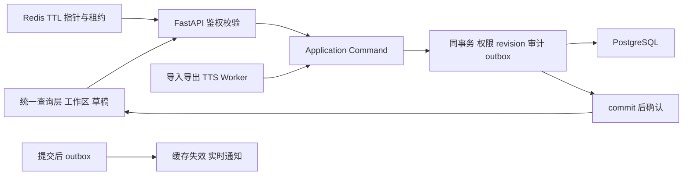

# UI / VNext 数据库架构方案（2026-10-02，仅方案，未实施）

## 1. 范围、依据与最新确认

本文以 VNext 源码与当前产品决策为依据，只设计 VNext 数据结构与契约。没有据此修改模型/服务、生成 Alembic 文件、实施数据删除或部署。**最新决定取消 Legacy 数据库/旧工程数据迁移，本文不再设计 SQLite→PostgreSQL backfill/cutover。**列模型的最新 canonical 需求见 [COLUMN_MODEL_REQUIREMENTS_2026-10-02.md](COLUMN_MODEL_REQUIREMENTS_2026-10-02.md)：业务列分为内置、预设、自定义三类，覆盖本文早先“所有业务列均可永久删除”的旧规则。下文 DDL、接口、作业和验收均为拟实施设计，不代表功能已完成。

功能基线为 `5e86a0bb11a20ecd631d9c2af66260a73d7c92e7`，保留其 WHAT；当前用户明确修改的行为优先。已阅读根 [AGENTS.md](../../AGENTS.md)、Legacy [AGENTS.md](../AGENTS.md)、[确认需求](CONFIRMED_UI_REQUIREMENTS_2026-10-02.md)、[执行记录](UI_REQUIREMENTS_EXECUTION_2026-10-02.md)、[Owner 矩阵](CANONICAL_OWNER_MATRIX.md)、[当前工作](ACTIVE_WORKSTREAMS.md)、[现状架构](ARCHITECTURE.md)、[迁移契约](ARCHITECTURE_MIGRATION.md) 和 [生命周期](LIFECYCLE_ARCHITECTURE_PLAN.md)。旧文档中的暂缓/归档规则在本文按最新确认覆盖，未改动其他文件。

已确认，不再作为待答复事项：

1. 业务列正式分为 **9 个内置列 + 20 个官方预设列 + N 个项目自定义列**。默认显示集合与列类别分开；预设字段可手动添加，自定义列可继续创建。内置列是核心 owner，**只允许隐藏、删除到回收站和恢复，不允许永久删除/Purge**；预设与自定义支持永久删除。
2. 列管理继续不设“归档”：隐藏只改共享视图；删除是软删除进入回收站。**只有预设列和自定义列在回收站提供永久删除**，永久删除需明确确认并清除当前及受控历史中的该项目列内容。内置列删除时保留 canonical 值和历史，以保证核心工作流不被破坏；其是否进入交付文件由导出页独立 allowlist 决定。
3. 自定义列宽、自动列宽、自定义行高、自动行高，项目共享视图同步给所有用户；**不能自定义列高**。权限、revision、异步保存确认统一。
4. 隐写水印必须实际嵌入、可追溯并验证裁剪/截图；metadata 签名不替代嵌入水印。文字和媒体采用不同载体。
5. TTS 提供可播放语速样例、缓存 audio，用实际音频预估朗读 duration；provider 可配置且默认本地，未经许可不外发用户正文。
6. 工程 PDF 默认多 QR 分片，DataMatrix ECC200 为替代；工程数据/媒体 hash 索引入码，大体积原图使用 PDF 关联 ZIP 附件或另存 portable project 包。

PostgreSQL 是 VNext 持久化目标，Alembic 是 schema 历史唯一 owner。Legacy SQLite 数据库不迁移、不回填、不作为 VNext 数据源；隔离 SQLite 仅可用于读取旧实现行为或测试 Legacy exporter。跨版本项目只通过便携工程文件 mapping 进入 VNext。本轮只编写本文件，方案批准不等于数据库实施或生产访问授权。

## 2. 源码证据与差距

| 已读来源 | 当前有的结构/行为 | 目标差距 |
| --- | --- | --- |
| `apps/api/app/core/database.py` | Base 字符串 ID、时间戳；get_db commit/rollback；db_session 为 function scope | HTTP 成功前提交；flush/乐观展示/job 入队不等于业务保存 |
| `models/production.py`、`shot.py` | Production/Sequence/Scene；Shot display_number/sort_index/revision/deleted_at；Panel/ProductionStep | 项目 schema/order revision、可删除核心业务值的 nullable 契约、跨项目 FK |
| `models/field.py`、`services/custom_field_service.py`、`column_lifecycle.py` | Custom 定义/值、ColumnPreference、purged tombstone、SavedView 清洗 | 全业务列生命周期与历史副本删除闭包不足；归档命名须收敛为 trash |
| `services/shot_service.py`、`version_service.py` | 标准单条/批量/排序命令；快照、恢复、分支/合并 | 当前 snapshot 主要是 Shot patch 字段，Panel/custom/import 对等未齐；沿同一 owner 扩展 |
| `models/collaboration.py`、`services/review_service.py` | Comment 引用/回复/解决；Version/ReviewDecision/Share/Export/Audit | 无逐用户 read 水位、稳定版本/列 anchor、完整 comment revision |
| `models/user.py`、`asset.py`、`view.py` | 用户/角色、Asset/AssetVersion/ShotAssetLink、SavedView | 颜色、crop/thumbnail、job/artifact、水印/TTS、共享尺寸策略需补 |
| `api/v1/shares.py` | expiry/revoke、固定 snapshot；token_hash 当前实际存原 token；业务在 router | 哈希 token、项目授权、密码、fieldallowlist、受权 media/export；不能据字段名宣称已有安全实现 |
| `services/import_service.py`、`importer.py` | 表格映射后调用 ShotService 创建；部分无效值会默认 75 帧/live 等 | 全格式识别、更新/替换预览和原子保存未齐；不静默使用默认值掩盖错误 |
| Legacy `server.py`、`schema_migrations.py` | projects/shots/project_snapshots/share_links、原始导入列、富文本、变更事件 | 与目标表名/类型不同；必须逐项映射，不直接照抄旧 DTO |
| Legacy `field_lifecycle.py`，含 golden 源码 | computed number/tc/duration 旧例外；历史快照不改；thumb 解除引用 | 最新规则按列类别分流：内置列不允许 purge；预设/自定义软删除保留历史，purge 显式脱敏受控历史 |
| Legacy `creative_boards.py` | 项目 JSON 聚合 revision；Moodboard V1/Lighting V2；50 板/500 总对象；Lighting z 高度、cm | 拆实体保留 ID/serializer/限制，2D/3D 不各存一套位置 |
| Legacy `import_parsing.py`、`import_staging.py`、`project_pdf_roundtrip.py` | XLSX/嵌图、私有 staging；工程 PDF backup 附件、摘要 QR、不可见文字来源标记 | 摘要 QR 不等于工程多码，文字来源提示不等于抗截图隐写 |
| `apps/web/lib/shot-table-presentation.ts` | 当前显示列名、pending 集合、默认隐藏负责人 | 有 UI key 不代表确定字段语义/存储；默认全列宽度表不是共享自动尺寸方案 |
| `apps/api/alembic/versions` | 两分支由 d72a81e5c409 合并 | 只证明源码图存在；实施前须核实实际库 schema/head |

## 3. 单一 owner、revision 与提交确认



- Table/Card/Timeline/Inspector/Review/画板共用 canonical API 和 query cache。路由只做 HTTP；import/OCR/TTS/AI/WS/background 不绕过标准 command 改业务。
- 服务端实体属于查询层；选择与工作区 UI 属唯一 workspace store；编辑 draft 单独保存。持久共享视图以服务端 SavedView 为准，localStorage 只是带 revision 的缓存。
- 命令携带 command_id、actor、project、expected_revision；批量带每个 Shot 的 revision map；涉及结构/顺序/视图时带 schema/order/view revision。receipt 唯一 `(project,actor,command_id)`，同 key 不同请求 digest 拒绝。
- 项目→列→Shot ID 的固定锁顺序；核对 project 权限、tombstone、全部目标集合、revision 后变更，写审计/outbox，同 UoW 提交。CAS/行锁覆盖读校验到写入窗口；no-op 不增业务 revision、不伪造变更审计。
- 成功 HTTP 响应只在 commit 成功后确认。外部文件先私有 staging 写完/hash，再 DB 发布引用；不假称对象存储与 DB 有跨系统 ACID。失败文件仅在确认无引用后异步清理。
- job 创建成功只代表排队事务提交；audio/export/symbol artifact 需生成、验证、发布事务成功才可播放/下载。durable WS 修改也遵守同一权限/revision/审计。
- dirty→saving→acknowledged/failed/conflict；异步 cache 允许 optimistic draft，但 pending 不叫 saved。失败保留草稿，refetch 不覆盖 dirty。409 以 base/server/draft 三方 rebase；同字段冲突由用户选择，新 revision 重试，purged 字段不能重放。
- 排序用既有 sort_index；提交完整项目活动 Shot 集合，筛选只决定插入目标，不丢隐藏行。同事务按全顺序重编 001、002……。镜号属于内置列，即使从普通表格删除到回收站也保留 canonical `display_number` 并继续随排序更新；交付页可选择不输出镜号。ShotID、素材/批注关联不变。version_number 是快照序号，不等于并发 revision。

## 4. 列身份、内置/预设/自定义与字段映射

最新列分类以 [COLUMN_MODEL_REQUIREMENTS_2026-10-02.md](COLUMN_MODEL_REQUIREMENTS_2026-10-02.md) 为准：**9 Built-in + 20 Preset + N Custom**。统一 `project_columns` 仍可作为项目列定义/绑定/生命周期 owner，但必须显式表达 `column_class`；预设 catalog 与项目实例分开，自定义/导入列使用项目自己的定义和值 owner。

内置 column identity 稳定，改名显示、翻译、列宽、顺序、删除/恢复不改变 identity，且不能进入 purging/purged。预设/自定义 project column 在 purge 后旧 identity/tombstone 不复用；同一官方预设或同名自定义以后重新添加时创建新的项目实例 ID/key，不恢复旧值。binding 只能由受审计服务器白名单解释，不能用标签拼 SQL。默认显示集合只在初始化/模板应用时决定，不等于列类别。

下表保留此前 32 项来源映射作为历史/导入语义参考，**不再代表目标列目录或统一生命周期**。当前普通产品列目录为 29 项；“原镜号 / 原描述 / 分镜图框 / 机位/运镜”等历史来源字段仅用于导入映射或 Import/Custom 列，不自动进入内置/预设 catalog。

| 序 | 名称 | 源码属性/候选 binding | 类型/归属与映射决策 |
| --- | --- | --- | --- |
| 1 | 分镜画面 | Panel→AssetVersion | Shot 下多 Panel/媒体，保留全图而非只首图 |
| 2 | 镜头 | UI shot_reference，待定 | 不等于镜号或内部 ShotID，不猜别名 |
| 3 | 时码 TC | tc_in 派生 | rational fps+起始帧+全顺序累计时长；导入原 TC 另辨 |
| 4 | 时长 | Shot.duration_frames | bigint 帧；NULL/0 分开，秒为呈现，业务值可 purge |
| 5 | 镜头标题 | name；Legacy title | text，Shot，可复用 |
| 6 | 篇章 | sequence_id/Sequence；Legacy chapter | 关联/自由文本待分流，重名不凭名称自动 join |
| 7 | 场景/地点 | Scene.location；Legacy shot.scene | 镜头明确值优先，否则主场景，其他场景不同显示差异；无主场景待确认 |
| 8 | 景别 | shot_size | 枚举/扩展词表，未知保留，不强转全景 |
| 9 | 焦段 | lens_mm；Legacy lens | numeric mm；区间/变焦/型号保留原值，不强转单 float |
| 10 | 运镜 | camera_movement；Legacy movement | 版本化 JSON/来源文本，转换器需确认 |
| 11 | 机位角度 | camera_angle；Legacy angle | text/枚举，与机位高度分开 |
| 12 | 画面描述 | description | text/富文本同字段 owner，不留平行权威副本 |
| 13 | 对应旁白 | voice_over；Legacy voiceover | text，TTS 依赖 column/version，不自动回写 |
| 14 | 制作方式 | primary_method+secondary_methods | 主/辅方法，保留各自语义，不等于执行方式 |
| 15 | 状态 | Shot.status | 业务枚举，与安全权限/审片决策分开 |
| 16 | 责任部门 | department | 业务部门，与 Role 权限分开 |
| 17 | 内外景 | Scene.int_ext | 镜头明确值优先，否则主场景值附差异；不改其他场景 |
| 18 | 日夜 | Scene.day_night | 同上，不等于拍摄时间/TC |
| 19 | 对白角色 | dialogue_character，待定 | 明确剧情角色引用，未解析文本保留来源，不绑负责人/用户 |
| 20 | 表演提示 | performance | text，Shot，可复用，与 action 分开 |
| 21 | 对白 | dialogue | text，Shot，可复用 |
| 22 | 剪辑/转场 | Legacy transition/UI edit_transition | VNext 对应持久属性未定，不写 composition |
| 23 | 备注 | Legacy notes/UI notes | 与 director_notes/continuity/risk 同义未定 |
| 24 | 动作 | action | text，Shot，可复用 |
| 25 | 原镜号 | original_number/原始导入列 | 来源 text，不随排序改，不覆盖 display_number |
| 26 | 可行性 | feasibility/原始导入列 | 等级/评估/text 待定，不猜 bool |
| 27 | 建议替换内容 | replacement/原始导入列 | text/提案待定，不自动替换 description |
| 28 | 原描述 | original_description/原始导入列 | 来源 text，与当前描述/快照分开 |
| 29 | 分镜图框 | panel_frame | 当前为 Shot text，不等于 Panel/图片 crop/ratio |
| 30 | 机位/运镜 | movement_reference/原始导入列 | 组合结构/text 待定，不合并 camera_angle/movement |
| 31 | 镜号 | display_number；Legacy number | **内置列**；业务显示值，非 row ID；全项目重编；可删除到回收站但不可永久删除，交付页可排除 |
| 32 | 执行方式 | execution_method/原始导入列 | 与 production_steps/制作方式关系待定 |

alias 记录 source_format/header/schema_version→column_id+converter_version；仅已确认别名自动映射。名称相近仅作建议；同名 UI 去重不丢源表列号/表头。NULL、空字符串、0、false 分开。负责人属于官方预设列，适用预设生命周期；复选/批注提示/操作是系统控件，ID/FK/revision/安全字段不放列管理。

## 5. 按列类别执行删除、永久删除与历史内容处理

### 5.1 生命周期与确认流程

| 操作 | 内置列 | 预设/自定义列 |
| --- | --- | --- |
| 共享视图隐藏 | 值/历史不变，只改所有用户的显示 | 值/历史不变，只改所有用户的显示 |
| 删除到回收站 | `state=trashed`；**canonical 值和历史保留**；可恢复原 identity | `state=trashed`；当前值/历史保留；可恢复原项目列 identity |
| 永久删除 | **禁止；UI/API/服务端均不得提供可达 purge 路径** | 允许；清当前值、受控历史内容、登记引用和受控副本；保留最小 tombstone/删除记录 |
| 导出交付 | active 时也允许逐列取消导出；trashed 内置列默认且强制不进入新的普通列型交付 | active 时可逐列取消；trashed 默认不出；purged 必须从模板/任务引用清除 |

以下 Purge 流程**只适用于预设列和自定义列**。内置列只能 Delete/Restore，不进入 PurgePreview。标准流程：PurgePreview(project,column IDs)→服务端先拒绝任何 builtin ID→统计影响 Shot/版本/项目快照/批注线程/审计 old-new/导出缓存/工程副本/媒体依赖及存储清理→AlertDialog 展示实际范围与数量→用户明确确认→PurgeColumnsCommand。产品不增加关于外部副本/备份的免责声明；技术能力边界只在本方案/内部清理报告记载。

preview 返回短时一次性 confirm_token、preview_digest、expected_project/schema/column revision 和 purge_epoch。token 服务端保存 hash，或签名后配一次性 receipt；绑定 actor、项目、column IDs、删除闭包、计数、内容高水位和有效期（拟 5 分钟），不含 value。仅按权限取得 token 不算确认，最终命令必须从 AlertDialog 明确提交 token 和 expected_revision。

purge 取锁后重验权限、token 未用未过期、scope/digest/revisions/高水位及依赖计数；期间有新增版本/评论/导出/job/copy，必须重新预览确认，不扩大已确认范围。相关命令均锁同项目并推进依赖高水位，避免预览校验之后漏入新副本。token 在业务事务 commit 后消费；相同 command_id 返回 receipt，commit 失败不消耗有效确认。未定 binding 先完成映射，不能猜删除字段。

### 5.2 删除闭包

| 位置 | purge 处理 | 可实现语义 |
| --- | --- | --- |
| 当前/回收 Shot/实体 | 被确认永久删除的预设或自定义值、相应导入原值和派生值；不清内置值 | 全部清理并增 revision，不保留改名内部副本 |
| ShotVersion/ProjectSnapshot/Share snapshot | 嵌套定义/值、图引用、比较差异 | 授权 purge 是历史内容删除例外；移除旧 payload 中该列，不保留可下载旧件 |
| 评论/quote/anchor/回复 | 匹配 column/version 的引用、正文复制、图像/TC anchor 及关联线程内容 | 清正文/quote/anchor，保留技术 ID、作者/事件和 redaction marker；不能保留另一份 quote |
| audit/change events | old/new、diff、metadata 中该列值 | 内容脱敏，保留 actor、ID、时间、操作、数量、结果；不存可反推低熵值的 hash |
| view/mapping/template | 列序/宽度/冻结/筛选/分组/导出默认值 | 清 ID 引用，后续读写都按 tombstone 过滤，防旧客户端/预设复活 |
| cache/index/search/staging | query cache、Redis、搜索索引、OCR/parse/raw 文件、临时导出、缩略图/audio | outbox 失效/清理；下载实时检查 epoch；多字段原件难以可靠局部清理时撤销整件 |
| artifact/工程副本 | PDF/Word/CSV、隐写媒体、TTS、QR chunk/符号、ZIP/portable、受控快照复制 | 清依赖列或撤销并删整件；取消 pending job；worker 发布前重验 epoch，不能写回旧结果 |
| shared media | 同列 Panel/历史/derivative 引用解除，GC 重查全局引用 | 仅无合法其他引用时删 bytes；未删除画板/独立资产/其他项目引用列明原因，不能误删共享原图 |
| 未登记自由文本复制 | 旧无 anchor 评论/描述内可能重复该值 | 先来源/依赖核查并给内部异常清单，不能用猜测保证所有自然语言副本识别 |
| backup/PITR/WAL/历史存储版本 | deletion ledger、期限、访问与擦除策略 | 恢复前重放删除 ledger；未交付物理擦除不说已擦除 |
| 用户已下载/离线/纸面码/截图 | 服务端不能直接删设备文件 | revoke 仅阻断后续受控访问，不能撤回已得到的 bytes；不写入产品免责声明 |

普通历史不可改；purge 明确采用 `purge_exception`、删除清单、redaction marker/content_revision 保留发生过的证据，不能修改 immutable 历史后装作该字段从未存在。内部审计只留最小元数据，不留 value。快照保留版本 ID、拓扑和决策；有效脱敏 payload 重算 hash，旧 digest 如能暴露值也不保留。restore/branch/merge/离线 replay/工程导入先应用当前 ledger，再进入标准 command，不能复活已删列。

状态拟为 planned→logical_committed→cleanup_pending→completed/failed。DB 事务清值/历史/审计内容、写 tombstone/ledger、撤销副本和 outbox；大闭包可分批清理，但逻辑禁用先提交，UI 只报告正在删除。completed 需受控 DB/index/staging/storage 检查通过；备份、外部副本能力记录在内部报告，不能混称全介质已擦除。

### 5.3 核心 NOT NULL 业务列与备份方案

`duration_frames / name / status / display_number / sequence_id / description / primary_method / panel_image / tc_in` 按最新分类属于内置列，因此**不再为了支持列 Purge 而迁成 nullable 或清空业务值**。它们从 Shot Table 删除只改变列生命周期/呈现，不改变核心 canonical owner；相关时间线、Review、排序、Panel/Asset、项目层级等功能继续按真实值工作。

内置列不允许通过“永久删除”制造假 0、空值或第二套隐藏字段。是否出现在 PDF/Word/XLSX/CSV/分镜表等普通交付中由导出字段 allowlist 独立决定；从表格删除到回收站的内置列默认且强制不进入新的普通列型交付。协议型 EDL/OTIO/SRT 的格式必需数据与表格字段开关分开标识。

Scene/Sequence 等绑定的继承/override 仍需单独确认。只有被归类为预设/自定义的项目列才进入 purge 删除闭包；同名/相近语义未确认时不共用存储。本方案不宣称现有实现已经符合最新分类。

备份采用两条候选路线：可改受控备份重新生成脱敏包并清存储历史版本/副本；不可变备份遵循受限保留期限、ledger 恢复过滤和经批准物理销毁。可研究 per-field crypto erase：每项目/column/purge epoch 独立随机 DEK 包封，当前值/历史/副本/备份不得含明文，销毁相应全部 key 副本后其他字段仍可读。单纯轮换 KEK/签名 key、仍保留旧 DEK、已有明文旧备份或 artifact 都不等于擦除。现有明文不能追溯地自动 crypto erase；密钥与备份恢复实测/审批后才可交付，不承诺本轮已有此能力。

## 6. 项目共享视图与自动宽高

SavedView 为共享布局唯一 owner，所有项目读者看到相同持久配置：column ID 顺序、visibility、width_mode/manual_width/computed_width、wrap、freeze；row_height_mode/manual_height、可选 per-Shot 手动行高覆盖；auto 算法版本、测量 context 与 generation/source revisions。不存在列高设置。每用户选择、指针、横滚位置和临时拖动草稿不作为共享持久布局。

默认项目共享，旧 private view 的迁移需列清单并由拥有者确认再公开，不能自动泄露。`project.view.read/write` 对应实际项目成员权限，schema/delete/purge 另有能力；没有新增权限配置时 fail closed，不默认所有用户可写。列宽/行高拖动仅本地预览，松手或 debounce 后提交一条带 expected_view_revision 的标准命令；其他用户收到 commit 后 outbox 的新 revision 才应用，不广播未提交结果为事实。

自动列宽：基于完整已授权活动行集合、列标题、字体/字号、图标/编辑 padding、换行规则和图像比例计算，按 min/max clamp。大项目可明确使用确定性样本并在 context 记录 sample policy，不能各用户按当前 viewport/筛选结果生成不同共享宽度。文本真实排版测量或经验证的字体测量器，非字符数乘常数假精确；图片宽度按 ratio/列限制取值。

自动行高：用确定后的列宽、可见列的换行文本、行内图片/控件布局计算各行最大需求，含 padding，min/max clamp；virtualized 行未渲染仍有确定策略，结果为派生 cache。列宽/可见性/内容变化使相关测量失效，行高不能反过来修改列高。固定高度溢出采用现有折叠/滚动呈现规则，不能裁掉数据。

手动优先：单列手动宽度和 per-row 手动高度不被自动 job 覆盖；用户显式“恢复自动/重算”才清对应 override。自动重算 job 绑定 view revision、source content/schema revision、字体/renderer 版本、宽度依赖 hash；只更新 mode=auto 且未并发变化的结果，冲突丢弃过时测量并重算，不能强覆盖。正文内容不进入公共尺寸日志。

共享维度使用标准测量 context；窄屏仍横滚/响应适配，viewport 临时 fit 不回写全项目尺寸。字体加载完成再测量，换行/中文/富文本/竖版图纳入验证。缓存 results 提交后通知所有用户刷新；失败保留本地 draft，显示失败；409 rebase 保留当前拖动意图但不能 last-write-wins 擦掉别人的共享配置。

## 7. PostgreSQL DDL 契约

### 7.1 通用约定与既有表调整

以下仅 DDL 设计，不执行 SQL。保留已有 `id text`，不强转历史非 UUID ID；新 ID 服务层生成。时间统一 UTC timestamptz，JSONB 结构有 schema_version。可变实体使用 bigint revision>0；技术演员 actor 与业务 owner_id 不同。跨项目引用用 `(production_id,id)` unique+复合 FK，单 ID FK 不足以约束项目。默认 RESTRICT，只有纯可删除子条目明确 CASCADE；注销用户走匿名化不级联清业务/审计。

| 已有表 | 拟调整字段 | 键/索引/删除规则 |
| --- | --- | --- |
| productions | revision/schema_revision/order_revision/content_revision bigint default 1；purge_epoch bigint default 0 | PK id；revision>0；content_revision 只反映创作内容；评论与审阅使用自己的修订；删除预览另捕获相关依赖版本，不把所有活动塞入内容向量 |
| shots | 各业务值按真实合同设置可空性，内置值不因普通删列改空；revision bigint；comment_event_seq bigint default 0 | unique production/id；活动 `(production_id,sort_index,id)`；不以 display_number 为身份 |
| sequences/scenes | 同项目 unique/FK；已确认多场景动态要求与逐项覆盖，镜头明确环境值优先，否则主场景附差异 | RESTRICT；删列不硬删技术实体/权限 |
| panels/production_steps | production_id；asset/input/output 版本引用收敛 | Shot/Asset composite FK；历史引用时 RESTRICT，显式硬删流程清依赖 |
| users | annotation_color varchar(7) NULL，revision bigint | CHECK NULL 或规范化 #RRGGBB；只本人/授权管理员可改 |
| comments | revision bigint、event_seq/last_activity_seq bigint、version_id/anchor_column_id NULL、anchor_type、anchor_json、content_deleted_at NULL；body可空 | 同项目/Shot parent/version/column校验；活动 project/shot/last_activity 索引；解决独立于已读 |
| shot_versions | production_id、source_shot_revision、schema_version、content_revision、content_sha256、redacted_at NULL | unique Shot/version_number；parent/merge同Shot；正常不可变，purge_exception脱敏 |
| assets/asset_versions | 同项目 FK、available/revoked 状态；实际 bytes hash/size 校验 | version序号 unique，storage_key unique；hash 约束回填后启用；去重不跨授权泄露 |
| shares | field_allowlist JSONB、policy_revision、purge_epoch、watermark_profile_id NULL；token真正hash | token_hash unique；project/revoked/expiry 索引；expiry/revoke所有字节入口重查 |
| saved_views | project共享 config/version；自动宽高 context/generation；revision | 列ID投影；旧key adapter只读转换；无两套layout同时写 |
| audit_logs | production_id、command_id、purge_event_id NULL、schema_version | project/time/id 与 entity/time 索引；正常append，内容脱敏专用受权路径 |

### 7.2 列与布局关键 SQL 草案

project_columns 接管 custom definitions+ColumnPreference 生命周期；shot_column_values 接管 custom values；existing SavedView 接管项目共享布局。扩展期单写 adapter 明确，contract 后旧表不再 owner。

```sql
CREATE TABLE project_columns (
  id text PRIMARY KEY,
  production_id text NOT NULL REFERENCES productions(id) ON DELETE RESTRICT,
  key text NOT NULL,
  label text NOT NULL,
  origin text NOT NULL CHECK (origin IN ('builtin','preset','custom','import')),
  column_class text NOT NULL CHECK (column_class IN ('builtin','preset','custom')),
  entity_scope text NOT NULL DEFAULT 'shot',
  binding_kind text NOT NULL CHECK (binding_kind IN ('entity','derived','custom','pending')),
  binding_key text,
  field_type text NOT NULL,
  definition_json jsonb NOT NULL DEFAULT '{}',
  schema_version integer NOT NULL DEFAULT 1 CHECK (schema_version > 0),
  state text NOT NULL CHECK (state IN ('active','trashed','purging','purged')),
  revision bigint NOT NULL DEFAULT 1 CHECK (revision > 0),
  deleted_at timestamptz,
  purged_at timestamptz,
  created_at timestamptz NOT NULL,
  updated_at timestamptz NOT NULL,
  UNIQUE (production_id,entity_scope,key),
  UNIQUE (production_id,id),
  CHECK ((state = 'purged') = (purged_at IS NOT NULL)),
  CHECK (state <> 'trashed' OR deleted_at IS NOT NULL),
  CHECK (column_class <> 'builtin' OR state IN ('active','trashed'))
);
CREATE UNIQUE INDEX uq_project_columns_live_binding
 ON project_columns(production_id,entity_scope,binding_key)
 WHERE binding_key IS NOT NULL AND binding_kind <> 'pending' AND state <> 'purged';
CREATE INDEX ix_project_columns_state ON project_columns(production_id,state);

CREATE TABLE shot_column_values (
  production_id text NOT NULL,
  shot_id text NOT NULL,
  column_id text NOT NULL,
  value_json jsonb,
  updated_by text REFERENCES users(id) ON DELETE RESTRICT,
  updated_at timestamptz NOT NULL,
  PRIMARY KEY (shot_id,column_id),
  FOREIGN KEY (production_id,shot_id) REFERENCES shots(production_id,id) ON DELETE RESTRICT,
  FOREIGN KEY (production_id,column_id) REFERENCES project_columns(production_id,id) ON DELETE RESTRICT
);
CREATE INDEX ix_column_values_lookup ON shot_column_values(production_id,column_id,shot_id);

-- 共享布局不再建立另一张权威 column_layouts 表。
-- 列显示、顺序、宽度、行高、筛选、排序和分组统一保存在 SavedView.config。
-- config 格式版本与业务 revision 分开，保存时校验列/镜头身份及权限。
```

前置 migration 为 shots/saved_views 加对应 composite unique。custom values 仅允许 custom binding，不能给 builtin 写 EAV 第二份值；类型/选项由统一 schema 验证。purged 定义清 label/description/options/default 等含业务内容，保留最小 id/key/binding/type/timestamp/tombstone；label 可为空字符串。JSON 内容和多态 owner 引用不是自动 FK，须显式依赖登记+command 验证。

### 7.3 新增与收敛表字典

拥有 id 的表用 text PK；可变实体有 created_at/updated_at timestamptz、revision bigint>0。下列 NULL 可空，其余 NOT NULL；未列 id 的关联表用指定复合 PK。FK 默认同项目 RESTRICT，下表明确例外。CHECK/unique/FK 在回填验证后启用。

| 表 | 字段/类型 | 键、索引、生命周期 |
| --- | --- | --- |
| SavedView.config 行高配置 | 全表策略及按稳定镜头身份的手动覆盖、自动测量版本 | 唯一共享配置，不新建第二份可写 view_row_layouts；不存可自定义列高 |
| view_measurements | id、production_id/view_id text、generation bigint、context_json jsonb、source_content_revision/schema_revision/view_revision bigint、dependency_hash char(64)、result_artifact_id text NULL、status text | unique(view_id,generation)；artifact同项目FK；view/generation索引；computed cache可失效，不与手动值竞争 |
| column_aliases | id、production_id/column_id/source_format/source_header text、source_schema_version/converter_version integer、confirmed_by text | unique(project,format,header,schema_version)；column/user FK；purge清规则 |
| purge_previews | id、production_id/actor_id text、token_hash char(64)、scope/digests/counts JSONB、expected_revisions JSONB、content_revision/purge_epoch bigint、expires_at/consumed_at(NULL) timestamptz | token_hash unique；project/actor/expiry索引；消耗与purge同事务，无value |
| purge_events | id、production_id/actor_id/command_id text、column_ids/scope/counts JSONB、purge_epoch bigint、status text、completed_at NULL、error_code NULL | unique(project,command)；project/epoch/status索引；最小ledger不含value；不cascade删除 |
| snapshot_redactions | id、production_id/purge_event_id/entity_type/entity_id text、column_ids JSONB、content_revision bigint、created_at | unique(event,entity)；purge_event FK；保留purge_exception/删除清单，不存旧正文/hash |
| project_snapshots | id、production_id text、version_number integer、parent_id NULL、schema_version integer、source_revision/content_revision bigint、payload JSONB、sha256 char(64)、redacted_at NULL、created_by | unique(project,version)；parent同项目RESTRICT；project/time索引；正常不可变、受权purge例外 |
| shot_comment_read_states | production_id/user_id/shot_id text、last_read_event_seq bigint default 0、read_at timestamptz | PK(user,shot)；user/Shot FK；seq≥0；project/user/shot索引；本人标读 |
| comment_events | production_id/shot_id/comment_id text、seq bigint、event_type text、actor_id NULL、created_at | PK(shot,seq)；Shot/comment同项目FK；不存正文，purge保留最小事件 |
| creative_boards | id、production_id/kind/name text、schema_version integer、width/height numeric、settings/environment JSONB、deleted_at NULL | unique(project,id)；kind=moodboard/lighting；尺寸>0；project/kind索引；Board revision统一 |
| board_shot_links | production_id/board_id/shot_id text | PK(board,shot)；双composite FK；project/shot索引；Shot软删保留，硬删先解绑 |
| board_objects | id、production_id/board_id/kind text、schema_version integer、sort_index numeric、x/y/z numeric NULL、rotation/scale/properties JSONB、asset_version_id NULL、deleted_at NULL | unique(project,id)、board内原对象ID唯一；board/asset FK；board/order索引；Moodboard z NULL，Lighting有限cm |
| media_presentations | id、production_id/asset_version_id text、owner_type/owner_id text、crop_x/crop_y/crop_w/crop_h numeric、scale/translation_x/translation_y numeric、ratio_num/ratio_den integer、fit_mode text、rotation_degrees/straighten_degrees/perspective_horizontal/perspective_vertical numeric、flip_horizontal/flip_vertical boolean、revision bigint | unique(project,owner_type,owner_id)；asset/owner同项目校验；crop 使用0～1归一化坐标并受边界约束；presentation revision只描述显示变换，永不覆盖 AssetVersion 原始字节；Panel/封面等不同 owner 可独立构图 |
| provider_profiles | id、production_id NULL、capability/name/provider_kind/model_version text、config JSONB、secret_reference NULL、enabled/local_default boolean | scope/capability/name unique（系统NULL scope需partial unique）；kind local/external；不存secret正文；配置不是外发许可 |
| external_processing_grants | id、production_id/actor_id/provider_profile_id/capability/input_digest text、scope JSONB、expires_at、revoked_at NULL | provider/actor FK；project/provider/expiry索引；绑定已审阅正文范围/版本与目的；撤销阻断queued发送 |
| processing_jobs | id、production_id/kind/actor_id/command_id/input_digest text、input_ref/expected_revisions/checkpoint JSONB、schema_revision/purge_epoch bigint、status text、attempt/max_attempts integer、lease_until/cancelled_at NULL、error_code/grant_id NULL | unique(project,actor,command)，project/id unique；grant FK；status/lease与project/time索引；revision CAS；不把正文放公共日志 |
| artifacts | id、production_id/kind/storage_key/mime_type/sha256/parameters_hash text、job_id/asset_version_id NULL、byte_size bigint、status text、source/schema_revision/purge_epoch bigint、expires_at/revoked_at NULL | storage unique，project/id unique；job/asset FK；size≥0；project/kind/status、expiry索引；staged/active/revoked/deleted，private字节 |
| artifact_dependencies | production_id/artifact_id/entity_type/entity_id text、column_id text NULL、entity_revision bigint NULL | unique artifact/type/id/column，NULL column用明确无列标识或NULLS NOT DISTINCT（版本验证）；column/artifact FK；project/column/entity索引；多态target service核验 |
| asset_references | production_id/asset_version_id/owner_type/owner_id/scope text、column_id NULL | unique asset/owner/scope/column同NULL规则；asset/column FK；asset与project/column索引；当前/历史/板/share/bundle全部登记 |
| import_sessions | id、production_id/actor_id/source_artifact_id/parser_version text、mapping/expected_revisions JSONB、preview_artifact_id/preview_digest NULL、schema_revision/purge_epoch bigint、mode/status text、expires_at、commit_command_id NULL | source/preview FK；mode append/update/replace；actor/status/expiry索引；commit key unique；重复返回receipt |
| export_templates | id、production_id NULL、name/format text、schema_version integer、layout/field_ids JSONB、watermark_profile_id NULL | scope/name/version unique同NULL规则；profile FK；版式/字段/水印独立，新增版本不改历史成品 |
| watermark_profiles | id、production_id NULL、carrier/algorithm_id/algorithm_version/key_id text、parameters JSONB、required boolean | scope/carrier索引；key只引用受控管理；carrier text/render/image/audio；算法待验证 |
| watermark_instances | id、production_id/artifact_id/profile_id/trace_id/key_id/embedded_payload_hash text、embedding_status/verification_status text、verification_report_artifact_id NULL | trace unique；artifact/profile/report FK；映射受限，无正文/凭据；未嵌入不能verified |
| tts_renders | id、production_id/provider_profile_id/input_digest/voice/model/language/pronunciation_version text、rate numeric、shot_id/column_id/version_id/audio_artifact_id NULL、duration_ms/sample_count bigint NULL、sample_rate integer NULL、sample_kind/status text | 缓存唯一键含scope+输入+provider/model/voice/rate/lang/词典；FK同项目；rate>0；project/shot/column索引；真实duration绑定audio |
| command_receipts | 合法项目或组织作用域、actor_id/command_id/request_digest、最小结果及提交时间 | 作用域外键和互斥约束；按作用域/账号/请求唯一，不伪造项目；同事务，无正文副本，重试重查当前权限和删除 |
| outbox_events | id、production_id/command_id/event_type text、entity_ids JSONB、revision bigint、published_at NULL、attempt integer | unique(project,command,type)；未发布time索引；同事务写提交后发，不含正文/秘密 |

媒体编辑的数据合同采用“immutable source + versioned presentation”：上传后的原始文件与 AssetVersion 为不可变事实；裁剪、缩放、平移、旋转、拉直、透视和翻转只更新 media_presentations。编辑 command 记录 expected presentation revision，成功后 revision +1；Undo/Redo 恢复 presentation 状态而不是复制旧文件。“载入原图”遵循最新镜头界面：完整原图按项目画幅适配、居中填黑，保留当前默认铺满及已有胶囊缩放、锁定、草稿撤销规则；不删除源 AssetVersion。资产库更新素材默认构图，只影响没有专用构图的当前引用，面板与封面专用构图保持。项目内容提交、审阅与交付固定当时有效构图和默认版本，历史恢复不更改资产的全局默认值。

Review 的 Before/After 读取两个明确 revision 的 AssetVersion + media presentation，并渲染成实际图片供视觉比较。数据库可以保存参数用于可复现渲染、审计和版本恢复，但 Review API/UI 不以 crop 数值或 transform JSON 作为用户主要差异展示。派生缩略图/预览是可失效 artifact，presentation revision 改变后必须按 dependency 使旧缓存失效并允许 GC；不得把派生图当新的原图版本。

旧 exports 先引用 job/artifact，消费者迁完后变兼容投影并退出，不能长期两套 export 状态机。全套表不是一次上线要求；具体迁移批次、源数据回填与回滚演练尚待完善，见交接文档。实施时核验最新模型和唯一 Alembic 节点，按独立工作包新增迁移，不照本节旧全表草案重复建已存在表。

### 7.4 最新资源与时间合同

第15、16问取消库房、库存和预留，只记录指定时段需要什么，器材知识只含型号和基础知识、不含使用方法。来源候选和需求查询由独立resource_demand_service负责，复用场景要求、镜头逐项覆盖、已有导入结果及项目权限，见[资源方案](RESOURCE_TIME_REQUIREMENTS_2026-10-04.md)。

同时间独立需求相加，明确共用只计一次，不同时段分别汇总；未排期或缺型号、数量、单位分别列出，不假设资源可用。时间区间采用UTC前闭后开，需求投影可重建、不作第二套可编辑事实。不创建库存、预留、数量配额或库房资格表；人员场地仍在原排期模块，显式共享身份后校验跨项目冲突。项目根→对象的稳定锁序保持。

FPS改变自动保留镜头秒数重算帧数，统一分数帧率与舍入，派生时码同事务更新；正秒数至少一帧，总量舍入差异预览。音频实测秒数和UTC排期不变。共享视图布局仍由SavedView独占，个人布局退出权威配置双写。

知识贡献复用后台用户组的团队归类，采集时固定项目成员全部团队；成员换组只影响之后的新经验。数据库保存稳定贡献范围及对应版本，原始回答与团队合格汇总分别鉴权，详见[知识库](VNEXT_KNOWLEDGE_LAYER_REQUIREMENTS.md)。

## 8. Legacy 数据迁移设计已取消；保留文件桥接

2026-10-02 用户明确决定：

- 不迁移 Legacy SQLite 数据库；
- 不迁移旧工程/旧媒体/旧分享数据；
- 不做 Legacy API/session/runtime 兼容；
- 不做 Expand/Backfill/CDC/双写/旧 owner cutover；
- VNext 只需验证空 PostgreSQL → Alembic head、新系统事务/约束/备份恢复。

因此此前本节关于源数据库映射、批量 backfill、增量对账、owner generation、旧库回退和 Contract 删除的设计不再执行。需要追溯时使用 Git 历史，不把它继续当待办。

### 8.1 唯一跨版本数据合同：便携工程文件

Legacy 可继续提供一个**显式导出的工程文件**作为人工迁移入口。允许为此修改 Legacy exporter 源码，但桥接必须是文件级、单向、可验证的：

```text
Legacy project
  → Legacy exporter
  → portable project artifact
  → VNext import preview / mapping
  → VNext commands
  → PostgreSQL + object storage
```

最低合同：

1. 文件带 schema/version、项目元数据、Shot/Panel/字段/版本所需数据和媒体清单；
2. 媒体使用稳定路径/hash，不依赖 Legacy 服务器在线；
3. VNext 先校验、映射和预览，再通过标准 command 写入；
4. 未识别字段进入可见 mapping，不静默丢弃或猜类型；
5. 导入失败原子回滚，不直接连接或读取 Legacy SQLite；
6. 保留脱敏/合成 round-trip fixture，覆盖 exporter → importer；
7. 格式演进采用文件 schema version，不承诺 Legacy API 或数据库 schema 兼容。

旧工程是否进入 VNext 由用户显式导出/导入决定；没有导出文件时，旧工程数据视为不在 VNext 范围内。
