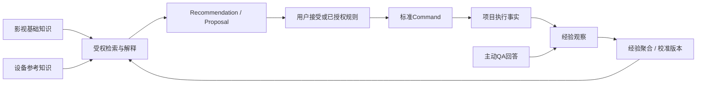

# FrameForge Knowledge Layer：知识体系架构需求与执行合同

版本：1.0，2026-10-04。状态：**需求与实现合同；不代表知识层已上线**。基于用户提供的独立需求稿优化，保留其核心定义。与 [扩展性总纲](VNEXT_MAX_EXTENSIBILITY_REQUIREMENTS.md)、[实施计划](EXTENSIBILITY_IMPLEMENTATION_PLAN_2026-10-04.md)、[执行标准](EXTENSIBILITY_EXECUTION_STANDARD_2026-10-04.md) 配套，不新增预算、采购、合同经营或财务领域，不重写既有 UI。

本轮用户已确认：**团队内项目经验默认贡献**，原始数据仍按项目权限隔离，不跨团队共享；**收工/阶段结束集中提示，每天最多3个主题，可跳过/稍后，不中断编辑**；**AI生成只在候选提案区，附独立证据并经人工验证后才能进入正式知识**。下文以这些决定为准，不保留两套待选行为。

## 1. 目标和不可混淆的边界

知识层连接影视基础、设备参考、项目执行经验、系统主动QA采集、经验校准与受控建议。目标是为制作团队提供可追溯的解释、经验分布和计划建议，而非让 AI 回答累积成事实。

| 领域 | 权威问题 | 例子 / 排除项 |
| --- | --- | --- |
| Film Knowledge | 影视制作概念与方法是什么 | 景别、运镜、灯光、Coverage、Company Move、Room Tone、Call Sheet、DOOD等；不属于某项目实际状态 |
| Equipment Reference | 设备型号是什么、具有什么经核验能力 | 厂商型号、接口、配件兼容、额定与实测条件；不含库存、借用、预约、维修 |
| Equipment Resource | 实际有什么资源可调用 | EquipmentUnit、Kit、Availability、Booking、Assignment、Maintenance；只引用参考型号，不由知识库推定“可用” |
| Project Facts | 当前项目真实发生或计划了什么 | Shot、Scene、Task、Schedule、Person、Asset、Review等；保持原 domain owner |
| Experience | 过去一次执行发生了什么、谁如何观察 | 实测、用户报告、QA解释、修正、上下文、来源revision；不同可靠性分别保存 |
| Knowledge Aggregate | 多个可用样本支持什么经验分布 | 样本数/独立执行单位数/项目数、P50/P75、适用条件、不足与异常 |
| AI / Recommendation | 如何消费已有知识给出建议 | 受权检索、引用来源、生成 Proposal；不写项目事实、不自动成为知识来源 |

QA 在本文仅指 **系统主动采集制作经验**。CI/测试 QA 仍称“验收测试”，用户检索问答称“知识检索/辅助问答”，三者不共用数据表或完成状态。

## 2. 四层结构与消费链

知识修订、重新统计或检索本身不更改项目。已批准规则只能按其固定 scope/知识profile版本、权限、CAS、Purge fence 执行标准 Command；新增知识不自动授权新规则。正常制作联动仍按扩展计划的既有自动联动合同运行，不把建议接受与全部联动混成逐项人工审批。

## 3. 来源、事实核验、衍生方式必须分开

用户稿将 Official/Manufacturer/Curated/QA Generated/AI Derived 放在同一来源枚举，实施时拆成三轴：

| 轴 | 内容 | 规则 |
| --- | --- | --- |
| source_type | official_reference、manufacturer_reference、industry_reference、project_event、qa_answer、manual_observation | 指证据来源；每条来源有 locator、版本/访问时间、允许保存范围与scope |
| verification_state | unverified、verified、disputed、withdrawn | 指事实核验状态与核验人/依据；“厂商发布”不等于所有条件下实测结果 |
| derivation_method | direct、summary、statistical、ai_assisted | 指处理方法与算法/模型版本；不是来源信用等级 |

事实、建议、经验观察和统计聚合分别 typed。精确数值需单位、测量条件、型号/地区/固件/时间范围（适用）；未知为空或 UNKNOWN，不用默认0。资料冲突保留两条证据与适用条件，人工确认优先解释不能抹去反证。知识失效、替代、纠错都生成新 revision，旧引用显示其当时状态。

影视基础与设备知识可共享 curated reference space；项目私有观察不因被检索到就升级为公共来源。库内只保存允许的结构化事实、摘要和必要引用，不把整本手册/项目正文复制进来源表。

设备示例只说明字段结构，不将需求稿里的某个型号参数当作已验证库存或性能。正式入库必须核对实际厂商页面/手册，保存 source revision和适用型号；“额定功耗”“实测耗电”“输出光照”是不同字段。

## 4. 权限空间与跨项目贡献

`KnowledgeSpace` 是知识共享范围，不替代 Work/Episode/Production，也不增加另一套登录系统。使用统一权限服务判定 `knowledge.read/contribute/curate/aggregate/recommend/purge`，角色称呼不直接授能力。参考知识、团队经验、项目原始观察分别投影。

已明确归属同一KnowledgeSpace团队的项目经验默认贡献；不要求每次回答重新勾选同意。没有明确团队scope或有效权限时仅项目内使用，不能从Work/Episode、邮箱域名或相同岗位猜团队。项目授权管理者可关闭贡献/撤回已贡献样本，个人回答仍按其资料scope。团队汇总必须记录贡献来源清单和撤回状态，不能通过摘要、计数、上下文组合泄露别的项目、客户、场地、人员或未公开作品。团队经验不跨团队共享。

原始回答始终按项目/问题/答者授权；汇总可见不意味着可读原始回答。触发和展示都重验当前权限；负责人转派或账号停用不会把旧答者私人答案转成新负责人可见正文。Person个人能力评分/排名默认不建立；团队条件用于校准制作方法，不用延误原因给个体自动贴标签。

团队发布的去标识 bucket 初始至少10个独立执行单位、来自至少3个项目；不满足时仅给原项目授权者展示原始分布或“样本不足”，不发布可反推的小组汇总。该门槛是首版工程参数，可经明确知识策略提高，不降低权限隔离。

## 5. 主动QA：触发不等于推定原因

真实触发来自 Task/Scene执行 owner 的确认事件、ActualRecorded/Corrected 等标准事实。当前尚无某事件时先补该事实命令，不靠用户点击一个页面猜“拍摄已完成”。

首版触发例子：`actual_setup_seconds > planned_setup_seconds * 1.3` 且差额超过配置的最小时长。比较同一工序、同一单位与同一计划基准；planned为0/缺失时不能算百分比，只标“计划缺失”或绝对差额。Shot片长、Task耗时、工序准备时间与排期时段不能混用。

QuestionDefinition 固定版本、trigger DSL、target role/capability、题目、答案schema、选项稳定ID、follow-up条件、使用scope、冷却/频率与有效性定义。不是写死一套问卷，也不允许任意脚本或AI即兴问题绕过权限与发布审查。修改选项/单位产生新version，历史答案保持旧题干语义。

默认在收工或阶段结束集中提示，同一账号跨项目合计每天最多3个主题；不是每个项目各3个。每日计数按账号偏好时区（默认Asia/Shanghai）保存固定窗口，修改偏好不重置已用预算；无账号人员不制造假登录或发送外部通知。每个主题最多2个自愿追问，跳过/稍后不强制回答。实现支持关闭、冷却与无权限失效；提示不抢编辑焦点、不阻塞保存或任务完成。QA 是采集经验，回答不是项目验收条件，不能为了“完整问卷”强迫填原因或时间。

触发记录唯一 `(source_event_id,question_definition_id,question_version,target_scope)`；重复/乱序事件不重复发问。计划或实际被修正时旧问题可 supersede，不能不停堆新通知。多个工种可回答但归到同一执行单位；回答冲突留作不同观察，不以最后回答覆盖实测。

原因可多选、允许未知/其他与自由补充。归因是用户解释而非被证实的因果关系；多个原因可重叠，总增加时间不强求相加等于总延误。连续实测区间的合并由原执行owner计算，不从多份QA时长重复累加实际耗时。

## 6. ExperienceObservation 数据合同

| 字段组 | 必需数据 / 约束 |
| --- | --- |
| identity/scope | stable ID、production_id、KnowledgeSpace贡献状态、执行单位ID；scope FK不能跨项目偷连 |
| source | source_event/source_entity/source_revision、采集方法、答者/系统principal、observed_at及recorded_at（UTC） |
| target | 工序/metric稳定ID，例如 lighting_setup_seconds；Task/Scene/Shot typed references，不用万能entity字符串当权限 |
| context | 已允许的内外景/昼夜、景别、制作方式、人员规模、设备型号/数量、场地条件；缺失单独标记；固定当时context version |
| planned/actual | 数值、单位、计划基准revision、实测区间/证据或self_reported标签、precision；duration非负有限值，bool不是number |
| cause | 原QA answer revision、多个原因、可选估计增加时间和解释；不混入measured actual字段 |
| quality | measured/self_reported/estimated、核验状态、有效/撤回/排除原因；不凭答者岗位自动提高可靠性 |
| lifecycle | revision、source修正链、贡献许可、普通删除/恢复、purge标记及统计失效状态 |

原项目事实不是复制后继续双写：Observation 固定来源revision的可受权证据引用，统计材料按贡献协议最小化保存。Actual修正命令产出新事件，原Observation superseded并触发受影响聚合重算；不直接改项目Actual。来源被Purge或贡献撤回后取消参与，不把旧hash、模型缓存或回答当后门恢复。

## 7. Aggregate / EstimateProfile：统计与置信度

计数单位先声明：一个共享灯光setup被6个镜头使用，算1次执行样本；同一事件重试、多个QA回答、同素材副本不算新实测。不同执行、工序或单位不能混入一个bucket。保存去重identity、参与Observation revisions、排除清单和贡献版本。

Aggregate 至少包含 context schema、metric/unit、time window、sample_count/independent_unit_count/project_count、缺失/实测/自报数量、P50/P75、计算方法版本、来源digest、computed_at、validity。初版分位数采用成熟统计库的明确 `linear` method，固定输入fixture确保可复现；不自己写一套不明算法。

0、缺失、取消、异常值分别处理。异常不静默删：原记录保留，统计排除需方法与理由；实测与自报分组或明确权重，不以“平均35分钟”掩盖数据质量。首版不输出个人画像，不自动从姓名/公司推定人员能力。

P75是经验分布位置，不是75%置信度。不能仅因46个或86个样本就标“High confidence”；统计区间、样本独立性、context覆盖和预测回测各自有方法/版本。未校准时 confidence_method为未提供，展示样本数、分布与适用边界。Recommendation budget quantile（例如P75）与概率置信区间分开。

EstimateProfile 是不可变计算版本，含aggregate refs、条件匹配规则、缺失处理、算法版本、训练/验证时间范围和适用范围。跨项目/时间holdout验证，不能随机拆同一执行的多回答造成泄漏。记录MAE、实际超预算率、覆盖率、分组误差；与原计划基准比较。暂无足够样本时返回INSUFFICIENT_DATA，不产伪精确建议。

新profile不重写已确认计划/实际/已发布通告；建议明确引用profile version。模型重算可生成新预测投影，真正改计划经用户接受或已批准规则Command。来源撤回使旧profile STALE/WITHDRAWN并使相关建议过期；重新计算不能伪装原版本仍有效。

## 8. Adaptive QA 的可接受自学习

“自学习”首版指受控的统计校准与问题优先级更新，不默认上传数据训练外部模型。记录问卷曝光数、符合条件数、回答率、跳过率、完成时长、缺失原因、额外信息量与holdout预测改善。没有回答不等于没有该原因，问题少问不能反过来证明其无价值。

初版使用已发布QuestionDefinition池＋可重现排序策略，改变提问优先级不生成新业务事实。保留少量轮换探索机会（占既定频率预算），避免只问灯光而永远不知道演员/场地变化；不因为探索增加每日问题上限。先离线回放、与固定策略对比，再发布新policy version，可回退旧排序而不删回答。

题干/选项/隐私scope/强制性/通知渠道变化需人工发布；统计阈值/排序的可自动调范围明确配置。AI可以建议问题，但仍停在候选区。有效性不能仅用答者点击量，不能自动判断单个员工表现。

## 9. Recommendation / AI / 知识Rule

建议必须包含：target scope、请求者权限、输入project vectors、knowledge/profile revisions、source digest、候选动作、理由/适用条件、缺失项、替代方案和expiration。没有证据输出“暂无匹配经验”，不编造资料或样本。

AI使用统一Provider/Job/Proposal，默认无外发；启用时先经过有效provider配置与实际授权投影。检索返回受权事实与独立来源，不把回答生成物自动写回索引当新的证据。对资料中“执行指令”作为内容处理，不能调用工具/改权限/发布artifact。

AI生成内容只保存在候选Proposal区，`AI_DERIVED`是候选衍生标签，不是正式KnowledgeSource类型。附独立资料/实际记录并经有curate权限的人核验后，以那些真实来源进入正式知识revision，保留ai_assisted处理轨迹。没有独立证据不得升级为CURATED/verified；AI自身输出不能为自身验证。人工点击“接受建议”不是事实已核验的证明，项目Command接受与知识Curate是两个不同权限/命令。

知识Rule只表达版本化条件/建议关系；不是另一自动化执行器。可用“夜外景通常需要灯光准备”“转场含拆收/行驶/搭建”等解释，但设备数量/时长由事实或校准提供。外部资料描述的经验不能转成无限制强制规则。

Knowledge Graph 延后到检索真实需求；使用知识域内Concept、ReferenceModel、WorkflowConcept和明确 relation_type的typed links，来源与revision必需。禁止建覆盖所有Project/Person/Task的万能graph owner。业务资源/出演/调度关系仍归原domain。

## 10. Equipment Reference 与 Resource 接入

`EquipmentReferenceModel` 固定厂家/型号/variant/region、spec版本、字段单位与source refs；型号更正或规格更新生成revision。`EquipmentUnit` 可引用model，但序列号、数量、位置、维修、租借和预约只在Resource。知识更新不能自动取消预约或改可用状态。

Reference compatibility 明确 verified/theoretical/conditional，写实际mount/power/connector及必要adapter，不用名称相似推定兼容。型号别名只用于检索候选，库内稳定ID不同于用户库存unit ID。

灯光2D/3D可受权选择已验证型号规格作为明确对象属性来源；已有场景中的高度、角度、功率是项目内容，不被知识新revision覆盖。resource选择是否确有该型号/配件由Resource query检查。型号引用不是内置未经验证3D工程精度承诺。

## 11. 应用内模块、接口与迁移写集

以下为拟实施seam，当前仓库未有独立知识层实现，不能当作已注册接口：

| 批次 | 唯一职责与拟写集 | 接口/约束与接入门槛 |
| --- | --- | --- |
| K0 知识事实 | `apps/api/app/models/knowledge.py`、`schemas/knowledge.py`、`services/knowledge_service.py`、`api/v1/knowledge.py` | KnowledgeSpace/Concept/Source/ReferenceModel/Revision；list/detail/query/curate，scope与source核验。注册/迁移由Integrator接入 |
| K1 经验采集 | `models/experience.py`、`services/experience_service.py`、`qa_learning_service.py`、对应schema/router | Observation、QuestionDefinitionVersion、QuestionInstance、AnswerRevision；trigger/answer/correct/skip/contribute/withdraw，来源去重、项目权限与每日预算 |
| K2 校准 | `services/knowledge_calibration.py`、`models/knowledge_calibration.py`、Job adapter | 冻结输入manifest、聚合/Profile，离线回测与受权查询，取消/迟到结果/Purge fence；现有Job/Outbox owner复用 |
| K3 建议接入 | `services/knowledge_recommendation.py`、typed Recommendation模型/consumer | query/propose/accept标准Command；匹配profile、真实来源、过期/权限变化和receipt幂等，AI仍可禁用 |
| K4 自适应与图 | 域内QuestionPolicy版本与明确knowledge links | 只有K1/K2实际效果/偏差回测过门槛后接排序/typed检索；不创建空KnowledgeGraph API或新顶层包 |
| 新UI（后续） | 已接受API后的真正缺失知识浏览、参考型号、经验总结页 | 现有UI由montblanc08主导；复用shadcn、query、draft/save状态。知识主动问题只进获授权新consumer，不改旧镜头表布局 |

API默认 `/api/v1/knowledge-spaces/{id}`、`/productions/{id}/experience-observations`、`/qa-learning/questions|answers`、`/knowledge-recommendations`。这些是职责合同，实际路由经schema/owner接受后冻结，不建立通用任意SQL/插件执行口。

模型字段保持显式typed关系；核心持久表使用同项目FK、来源ref、revision、UTC时间和生命周期。聚合中的context JSON为版本化统计输入，不能替代项目业务事实或FK。新迁移只在真实命令/query上线批次创建，以实际唯一Alembic head为parent，不预编SHA。

## 12. 历史、删除、恢复、导入导出

知识Revision是知识事实历史，Observation/Answer是独立经验历史，Profile是算法/样本版本；均不加入每次项目创作snapshot。项目只固定接受的建议/产物引用及对应Command receipt。普通修正形成新revision；任务实际仍由任务历史记录。

沿用本轮正式来源/产物、临时24小时与可重建7天的留存决定。知识来源、QA回答、Observation正文Purge需确认与impact preview：清各revision正文、来源摘录、搜索/vector cache、聚合sample refs、job staged输出、recommendation、受控下载，保留无正文ID/epoch删除标记。

贡献撤回解除统计参与，不能误删原项目合法事实；Purge按对象闭包清正文并防undo/import/旧job/backup复活。所有受影响profile/query先STALE，不继续输出旧有效建议；重算后新version。重算失败显式不可用，不保留偷偷消费的缓存。

项目工程导出默认不夹带私有QA、他项目样本、人员联系人或整库知识。若勾选受权知识引用，仅带必要stableID/version与允许摘要；接收方不能凭ID取得知识空间权限。跨团队便携知识包单独授权、manifest/来源许可/namespace映射，不复用项目导入权限冒充知识发布。

## 13. 必须运行的验收fixtures

| ID | 合成输入 / 失败注入 | 接受条件 |
| --- | --- | --- |
| KL-01 事实与资源 | 一型号两设备unit；unit维修/已预约，知识参数更新 | 库存状态只由Resource决定，型号修订不改booking或已存Lighting对象；不会推荐“系统已可用” |
| KL-02 来源与AI | 冲突厂商资料、人工观察、AI无来源提案、已核验引用后来源withdraw | 类型/核验/衍生分开；AI无证据不进正式事实，不对外编造source；旧引用显示失效 |
| KL-03 权限与贡献 | 三项目两团队、非贡献项目、只读成员；列表/计数/query/Job/download | 原始答案与团队汇总权限分开；不跨团队，不泄露source正文/客户；撤销后缓存与Job发布受控 |
| KL-04 QA预算与去重 | 同完成事件重投、来源修正、多人回答、未回答/skip/稍后 | 一事件同题不重复、每日预算有效、不抢保存；缺失不记0或无原因，回答有版本 |
| KL-05 度量 | 计划0/缺失、Shot片长/准备耗时不同单位、同setup6镜头、重叠原因、负数/NaN | 不除0、混单位、重复计样或错误求和；非法数值拒绝；实测/自报分开 |
| KL-06 聚合校准 | 已知排序数值、独立units、偏倚回答、少样本/小团队、heldout项目 | P50/P75方法可复现；sample/项目数正确；不足不发布或伪精确；置信区间不冒用P75 |
| KL-07 建议命令 | 当前向量/知识version下建议；源修正、权限撤销、重复accept | 知识读取不写项目；accept走Command只一次；旧建议409/失效且草稿保留，非另写SQL |
| KL-08 Purge恢复 | 回答/来源被Purge、聚合/索引/工件/旧Job、备份和跨空间包 | 无正文标记；旧profile不可继续有效使用；重算/取消明确，旧备份补删除账，不能复活 |
| KL-09 自适应 | 固定policy与新policy时间回放、少问导致缺失、探索预算、无外网 | 可解释优先级/回退；不将少回答当低价值；不超预算、不外部训练、QA不强制 |
| KL-10 真实消费者 | 获授权新页面/合成项目/桌面横屏、读写失败/403/409/刷新 | 实际来源/经验/建议回读与ACK；已有表格/整行项目封面不退化；真实截图，不用build充视觉 |

PG门槛复用执行标准：真实空库/副本迁移、typed FK、唯一/并发、失败回滚、lease fence、restore/Purge。pytest强制SQLite不能替代PG。统计fixtures、来源文件均使用GitHub可发布合成/脱敏内容，不上传用户真实项目或密码/privateIP。

## 14. 实施顺序与完成定义

K0基础影视/设备参考 → K1真实执行来源与主动QA → K2经验统计/Profile/回测 → K3受权检索和建议 → K4自适应/typed知识链接/按需AI。K0依赖统一权限/receipt，K1依赖Task事实与Outbox，K2依赖持久Job，K3复用Command，不能用未验收mock数据向用户显示真实经验。

首版贯穿fixture：三个合成项目的灯光准备工序、不同型号参考、明确实测与自报；主动采集→授权贡献→去重聚合→解释建议→用户接受计划命令→Actual修正→建议失效及重算。没有权限/真实source/回读/Purge闭包时保持对应包未接受。

完成必须同时证明：知识与资源/事实分离、来源核验、QA频率/权限、统计可复现/不足处理、建议不旁路写权、撤回/Purge/恢复、迁移与真实consumer、脱敏证据及小步推送。本文不得以“自学习闭环”命名代替上述真实证据。
