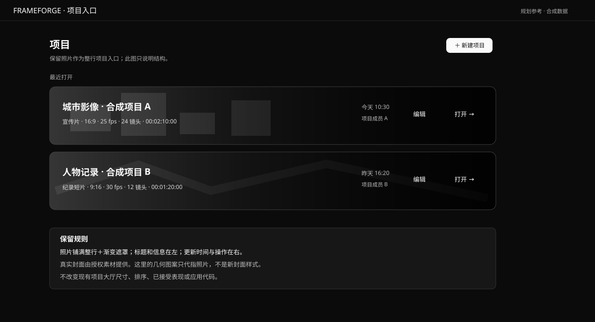
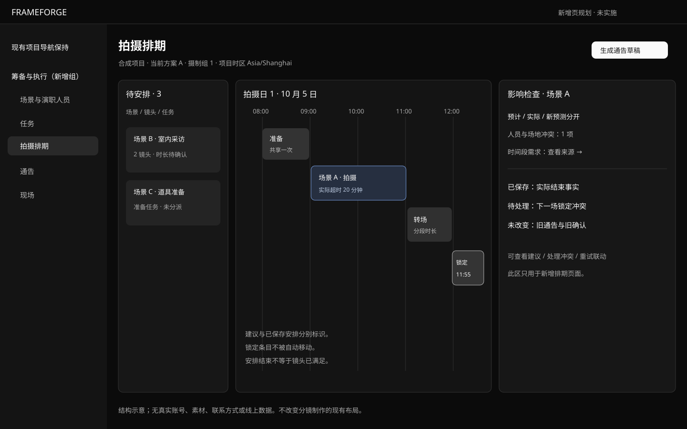
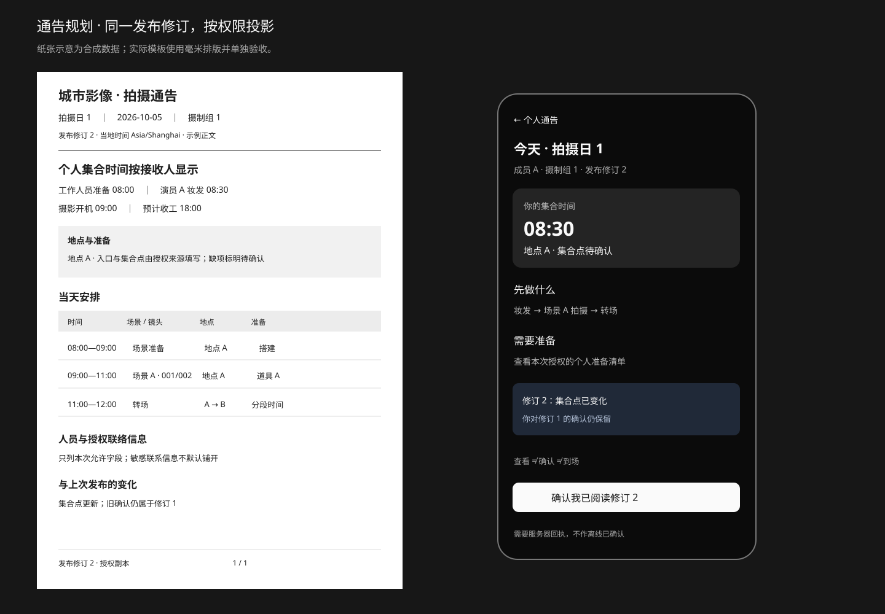

# UI 规划参考图

2026-10-05。仅文档规划，未改变现有 UI。这些 SVG 使用合成项目、人物和时间；没有真实照片、账号、地址或联系方式，不是运行截图或验收证据。

## 项目入口表现保留

必须保留整行照片、渐变、左侧标题与信息、右侧时间和打开入口。图中的几何形状只是照片占位，不是要求改掉实际封面。

## 新增排期页

只规划尚缺的排期工作页，不改变现有分镜表格。

## 通告纸张与个人手机视图

正式排版和真实文件另行实施验收；纸张、个人页共用固定发布修订，查看、确认、到场分开。

完整内容：[全模块界面规划](../../VNEXT_UI_PLANNING_2026-10-05.md)、[通告与导出设计](../../CALL_SHEET_EXPORT_DESIGN_2026-10-05.md)、[制作闭环审计](../../PRODUCTION_CLOSURE_AUDIT_2026-10-05.md)。外部 Yamdu 官方图片和 shadcn／StudioBinder 参考来源在规划正文中逐一注明。
